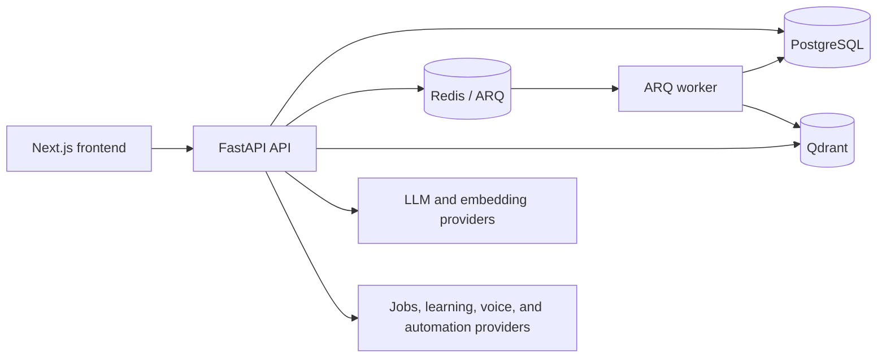

# CareerOS

CareerOS is an AI-assisted career intelligence platform that turns a candidate's resume, preferences, and job-market evidence into explainable job matches, skill-gap actions, learning paths, interview preparation, and application workflows.

## Hackathon problem

CareerOS addresses the Idea2Impact challenge of helping candidates move from fragmented career information to evidence-backed decisions and concrete next actions. The primary users are job seekers, mentors, career coaches, university employability teams, and HR reviewers.

## Implemented product surface

| Area | Current capability |
|---|---|
| Resume intelligence | Upload TXT/PDF/DOCX, parse content, mask PII, chunk, embed, index, and analyze |
| Jobs intelligence | Ingest provider jobs, normalize/deduplicate, match to candidate evidence, rank, and explain refresh outcomes |
| Skill intelligence | Evidence-backed skill graph and skill-gap findings with provenance |
| Learning | Verified seeded resources, optional live discovery, learning paths, gap actions, and outcome tracking |
| Opportunity workflows | Prioritization, governed alerts, duplicate suppression, conversational call integration, and outcome records |
| Interview preparation | Text/voice interview workflows, evaluation, feedback, and reports |
| Roadmaps | Persisted goals/tasks, progress aggregation, deterministic fallback, and honest telemetry labels |
| Docs-RAG | Mentor/HR chatbot backed by `docs/rag/`, Qdrant retrieval, citations, and optional Make.com orchestration |
| Operations | Health/readiness endpoints, structured logging, metrics, tracing, approval queues, and role checks |

Status details and limitations are tracked in [docs/MASTER_REQUIREMENTS_MATRIX.md](docs/MASTER_REQUIREMENTS_MATRIX.md), [docs/ROADMAP.md](docs/ROADMAP.md), and [docs/v2/current-capabilities-and-gaps.md](docs/v2/current-capabilities-and-gaps.md).

## AI architecture

CareerOS retains legitimate product AI components in the public repository:

- Gemini-oriented generation with backend fallback-provider abstractions
- NVIDIA embedding and reranking integrations
- Qdrant vector storage for resume, job, knowledge, and docs-RAG chunks
- hybrid retrieval, evidence assembly, citations, and weak-context handling
- LangGraph-style orchestration, agent governance, confidence thresholds, and human approval
- PII masking and prompt-injection checks before sensitive AI workflows
- explainable job, opportunity, learning-resource, and skill-gap scoring



For a deeper view, start with [docs/current-architecture.md](docs/current-architecture.md) and [docs/architecture/SYSTEM_ARCHITECTURE.md](docs/architecture/SYSTEM_ARCHITECTURE.md).

## Technology stack

- Frontend: Next.js App Router, React, TypeScript, Tailwind CSS
- Backend: Python, FastAPI, Pydantic, SQLAlchemy async, Alembic
- Data: PostgreSQL, Redis, Qdrant
- Background work: ARQ
- AI/retrieval: Gemini, NVIDIA NIM, Qdrant, LangGraph, LangSmith integration
- Infrastructure: Docker Compose, Nginx production configuration, GitHub Actions

## Repository structure

```text
backend/       FastAPI application, services, models, migrations, tests
frontend/      Next.js application and reusable product components
docs/          Public architecture, operations, roadmap, and RAG knowledge
demo/          Clearly fictional judge-ready candidate and job inputs
deploy/        Deployment helpers and Nginx configuration
workflow/      Product workflow descriptions
.githooks/     Public-safe staged-change checks
```

Private local development configuration, repository memory, real candidate files, local credentials, and generated runtime outputs are intentionally excluded.

## Quick start with Docker

Prerequisites: Docker Desktop or Docker Engine with Compose.

```bash
cp .env.example .env
docker compose up -d --build
docker compose exec backend alembic upgrade head
```

Then open:

- Frontend: `http://localhost:3000`
- API docs: `http://localhost:8000/api/docs`
- Liveness: `http://localhost:8000/api/health/live`
- Docs-RAG health: `http://localhost:8000/api/v1/demo-rag/health`

Review migrations before applying them outside local development. See [docs/startup_guide.md](docs/startup_guide.md) and [DEPLOYMENT_RUNBOOK.md](DEPLOYMENT_RUNBOOK.md) for alternatives and production notes.

## Environment and providers

The public template is [.env.example](.env.example); the variable catalog is [docs/ENVIRONMENT.md](docs/ENVIRONMENT.md). Local `.env` files are ignored.

The core stack can start with local PostgreSQL, Redis, and Qdrant. AI generation, live job ingestion, live learning discovery, cloud Qdrant, voice calls, and Make.com each require their own provider configuration. Real outbound calls remain dry-run by default in the public template.

## Database and Qdrant

Alembic migrations are under `backend/alembic/versions/`. The local Compose stack provides PostgreSQL, Redis, and Qdrant. For Qdrant Cloud, set `QDRANT_URL` and `QDRANT_API_KEY` locally; do not commit them. The docs-RAG collection defaults to `careeros_rag_docs`.

## Synthetic demo flow

No real candidate data or credentials are committed. The files under [demo/](demo/) are clearly fictional:

1. Start the public-safe stack: `docker compose -p careeros-publication --env-file .env.example up -d --build`.
2. Apply migrations: `docker compose -p careeros-publication --env-file .env.example exec backend alembic upgrade head`.
3. Register a new local account, or set `SEED_ADMIN_EMAIL` and `SEED_ADMIN_PASSWORD` locally before first startup.
4. Upload `demo/synthetic-resume.txt` from Knowledge Hub.
5. Seed one fictional opportunity: `docker compose -p careeros-publication --env-file .env.example exec backend python scripts/seed_public_demo.py`.
6. Analyze the resume and compare it with `demo/synthetic-job-description.md`.
7. Review match evidence, skill gaps, learning actions, roadmap outputs, and `/demo-rag`.

The seed command is explicit, idempotent, and local-only. It never runs at application startup and does not replace live provider ingestion.

Demo credentials are intentionally not stored in Git. A deployer may publish separate temporary credentials through the hackathon submission portal.

## Screenshots

Publication-safe screenshots are captured only from the synthetic/local demo flow. No screenshot containing a real candidate, credential, private conversation, or machine path should be committed.

## Verification status

Public readiness notes, validation scope, and known limitations are in [docs/PUBLICATION_READINESS.md](docs/PUBLICATION_READINESS.md).

- Backend: `1088` tests collected; `1040` passed, `48` skipped, `0` failed, with `207` warnings in the latest full local gate.
- Integration marker: `1` passed, `14` skipped, `1073` deselected, `0` failed.
- Schema: Alembic head is `033_schema_contract_alignment`; fresh upgrade and `alembic check` passed with `0` detected upgrade operations.
- Frontend: typecheck passed; Vitest ran `1` real CareerOS test file with `10` tests passed; lint had `0` errors and `211` warnings; production build passed with `30` app routes.
- Synthetic E2E: authentication, resume upload/analysis, local Qdrant RAG indexing, grounded chatbot answer with citations, fictional opportunity retrieval, skill-gap analysis, and non-admin access blocking passed.
- Dependency advisory status: `npm audit --omit=dev` reports `2` moderate advisories in the Next/PostCSS dependency chain; no forced major downgrade is applied.

## Deployment

Public deployment URL: **to be supplied by the hackathon team after deployment**.

The repository contains local and production Compose variants plus Nginx configuration. Treat production deployment as blocked until credentials are supplied through a secret manager, migrations are reviewed, health checks pass, and deployment verification is completed for the target environment.

## Privacy and security

- JWT cookie authentication and role-aware routes
- account lockout and rate limiting
- PII detection/masking before embedding workflows
- prompt-injection checks and governed external actions
- no committed `.env`, API keys, webhook URLs, real phone numbers, or private resumes
- public-safe pre-commit checks in `.githooks/pre-commit`

Security findings should be reported privately to the repository owner rather than opened with credential details in a public issue.

## Known limitations

- External providers can be unavailable, quota-limited, or unconfigured.
- Some analytics require real longitudinal activity and correctly return sparse or `insufficient_data` results.
- Conversational voice behavior requires provider-side configuration and explicit human-approved testing.
- Frontend automated coverage is intentionally small at publication time: the current suite covers core CareerOS UI/auth/demo safety behavior, but does not replace browser E2E coverage.
- Deployment, demo account, and public screenshots remain environment-specific publication tasks.

See [docs/v2/v2-risk-register.md](docs/v2/v2-risk-register.md) and [docs/rag/KNOWN_LIMITATIONS.md](docs/rag/KNOWN_LIMITATIONS.md).

## Roadmap

The canonical status and next work are in [docs/ROADMAP.md](docs/ROADMAP.md) and [docs/v2/v2-implementation-roadmap.md](docs/v2/v2-implementation-roadmap.md).

## License

CareerOS source files carrying `SPDX-License-Identifier: Apache-2.0` are distributed under the [Apache License 2.0](LICENSE). Review third-party dependency licenses separately.
