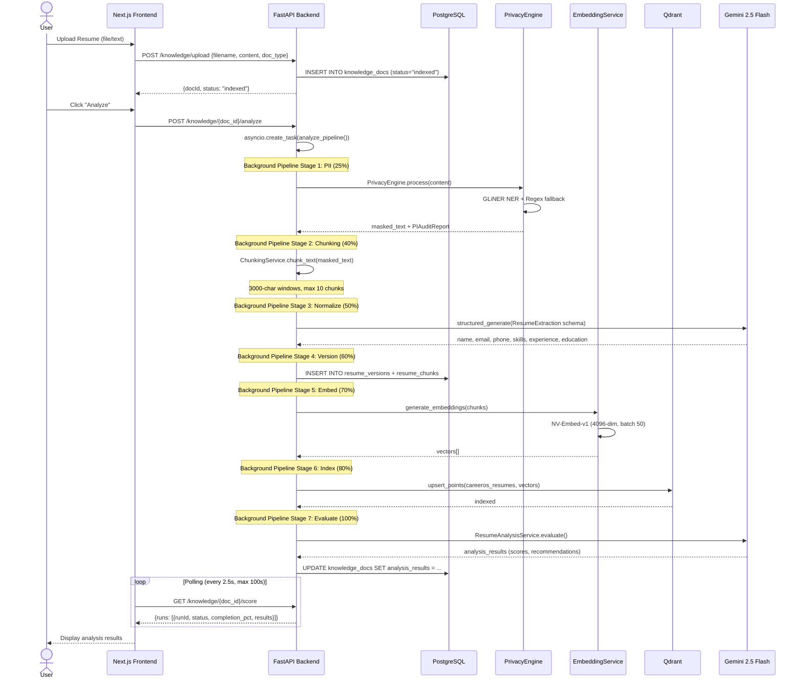
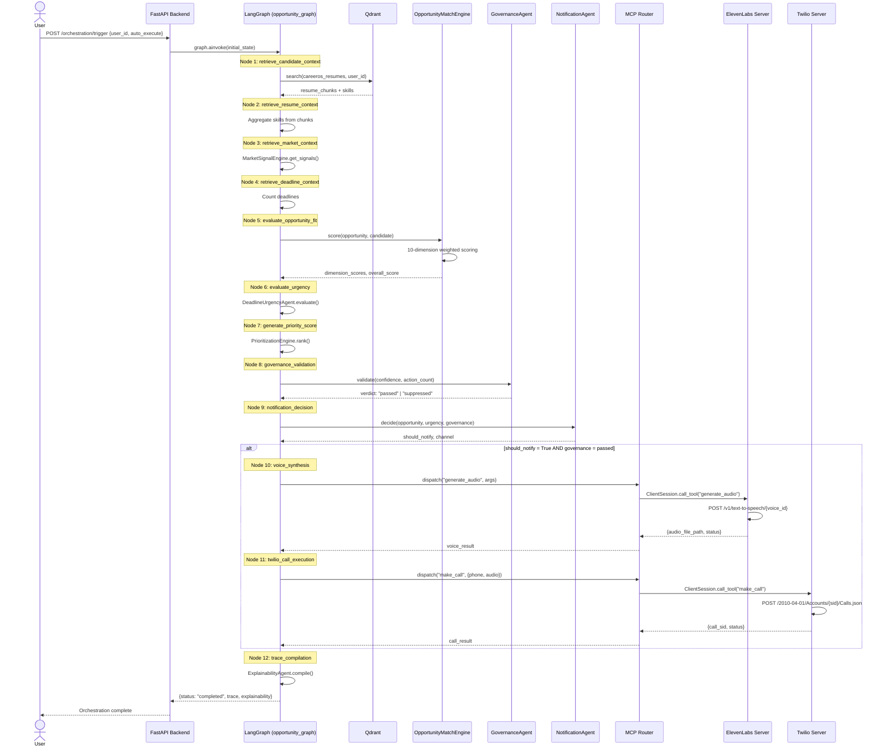
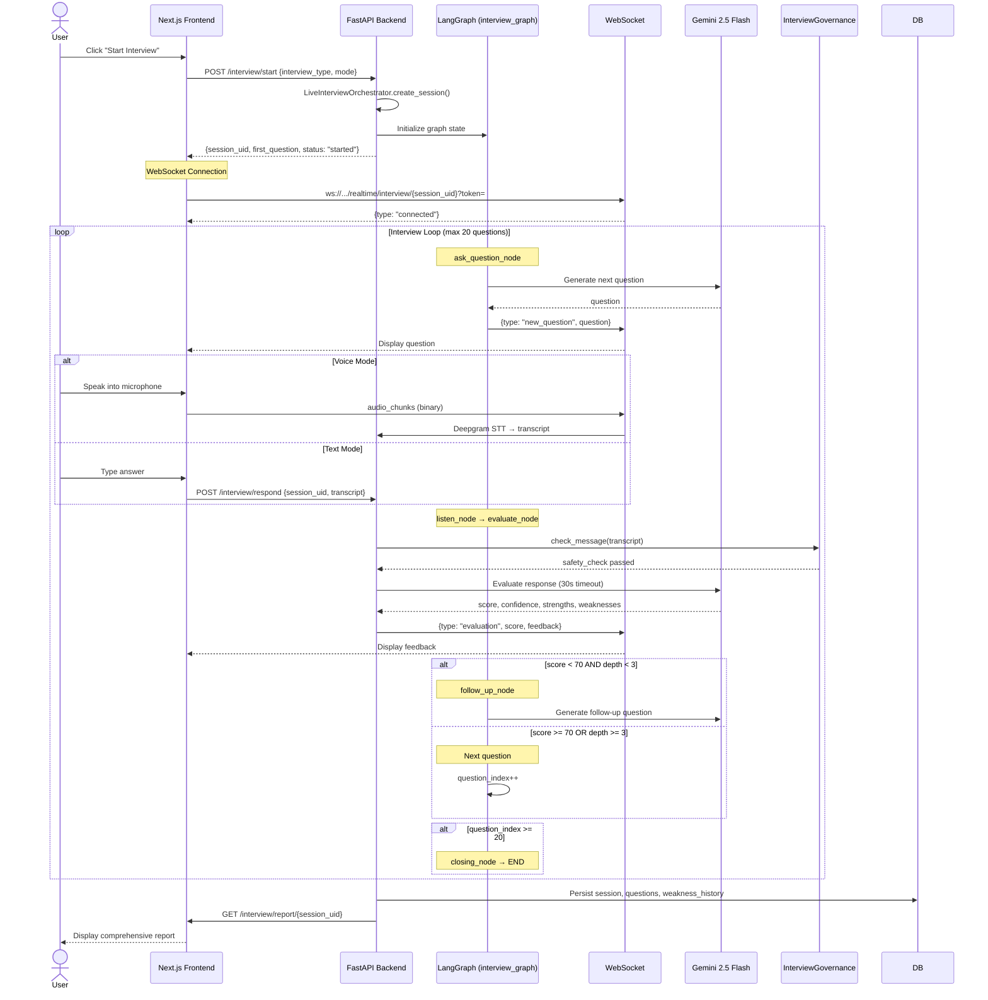
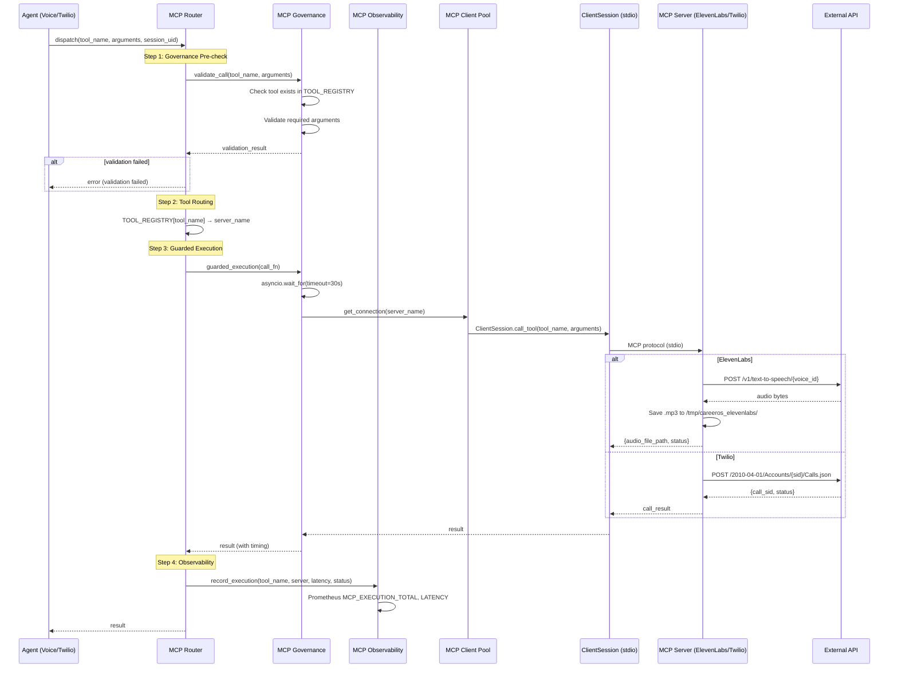
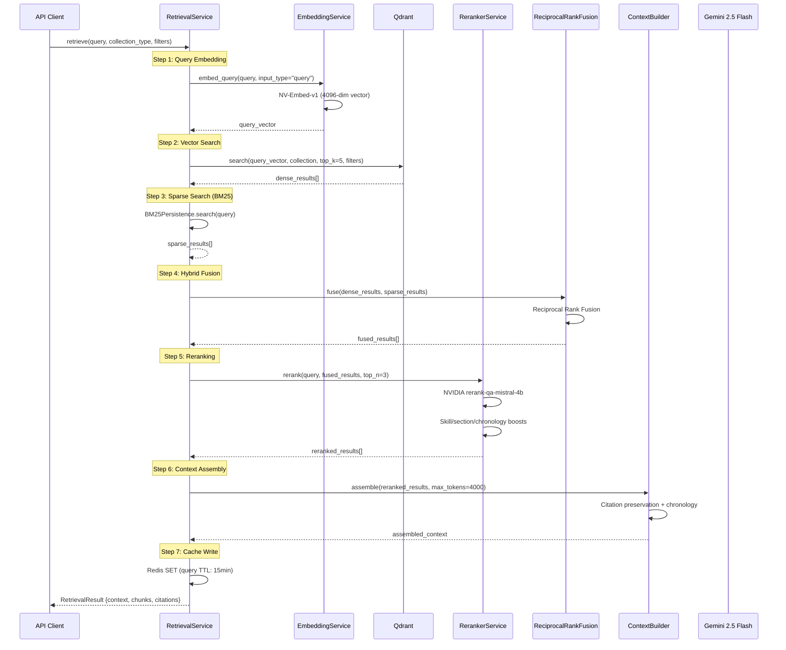

# System Architecture — CareerOS

**Generated**: 2026-06-06  
**Purpose**: Mentor-level architecture documentation for technical interviews, viva examinations, and portfolio demonstrations.  
**Verified Against**: Source code, runtime evidence, and retained public documentation

---

## 1. System Overview

CareerOS is an AI-powered Resume Intelligence Platform that demonstrates production-grade AI engineering concepts. It processes resumes through a RAG pipeline, matches candidates against job opportunities using multi-agent orchestration, conducts AI-powered interviews, and provides career readiness scoring — all with full observability, governance, and human-in-the-loop controls.

### Core Design Principles

1. **Agent-first architecture**: Every major workflow is implemented as a LangGraph state machine with explicit nodes, edges, and checkpoint persistence
2. **Layered resilience**: Circuit breakers, retry policies, fallback providers, and governance gates protect every external dependency
3. **Observability everywhere**: LangSmith traces, Prometheus metrics, structured logging, and an `/observability/llm` endpoint provide full visibility
4. **Human-in-the-loop**: Autonomous agent actions require governance approval above confidence thresholds
5. **Defense in depth**: PII masking, prompt injection detection, RBAC, account lockout, and audit logging

---

## 2. High-Level Architecture

```
┌─────────────────────────────────────────────────────────────────────┐
│                        PRESENTATION LAYER                          │
│  Next.js 14.2.3 App Router │ 23 Pages │ 19 Components │ 5 Hooks   │
│  useCareerOS.ts (REST) + useWebSocket.ts (realtime)                │
│  Tailwind CSS 4 │ Recharts │ Lucide React │ Framer Motion          │
├─────────────────────────────────────────────────────────────────────┤
│                        API GATEWAY LAYER                            │
│  FastAPI 0.111.1 │ 22 Routers + 3 WebSocket Routes                │
│  JWT Auth (HS256) │ RBAC (4 roles) │ Rate Limiting (30 req/s)     │
│  Nginx Reverse Proxy │ WebSocket Upgrade │ 15MB Upload Limit       │
├─────────────────────────────────────────────────────────────────────┤
│                     AI ORCHESTRATION LAYER                          │
│  LangGraph 0.0.69 (4 graphs, 29+ nodes)                           │
│  12 Agents │ Governance │ Explainability │ MCP Router              │
│  LangChain 0.2.43 │ LangSmith 0.1.147                             │
├─────────────────────────────────────────────────────────────────────┤
│                       SERVICE LAYER                                 │
│  24 Service Directories │ 12+ Agent Implementations                │
│  Intelligence │ Interview │ Opportunity │ Retrieval │ Reranking     │
│  Privacy │ Processing │ Resume │ Storage │ Security │ Strategy     │
│  MCP (ElevenLabs + Twilio) │ Readiness │ Evaluation               │
├─────────────────────────────────────────────────────────────────────┤
│                       DATA LAYER                                    │
│  PostgreSQL 15 (69 tables, 33 ORM models, 9 Alembic migrations)   │
│  Qdrant 1.18.0 (vector DB, 4096-dim cosine, 4 collections)       │
│  Redis 7 (cache/queue/state/BM25, 6-tier TTL)                     │
├─────────────────────────────────────────────────────────────────────┤
│                    INFRASTRUCTURE LAYER                             │
│  Docker Compose (6 dev / 7 prod services)                          │
│  ARQ Worker (Redis-backed task queue)                               │
│  Nginx (rate limiting, gzip, security headers, TLS)               │
│  Let's Encrypt (production TLS)                                    │
│  Observability: LangSmith + Prometheus + Structured Logs           │
└─────────────────────────────────────────────────────────────────────┘
```

---

## 3. Technology Stack

| Layer | Technology | Version | Purpose |
|-------|-----------|---------|---------|
| **Frontend** | Next.js | 14.2.3 | React framework (App Router, standalone output) |
| **Frontend** | React | 18 | UI library |
| **Frontend** | TypeScript | — | Type safety |
| **Frontend** | Tailwind CSS | 4 | Utility-first styling |
| **Frontend** | Recharts | 3.8.1 | Charting (readiness scores, analytics) |
| **Frontend** | Framer Motion | — | Animations |
| **Frontend** | Lucide React | — | Icons |
| **Backend** | FastAPI | 0.111.1 | Async Python API framework |
| **Backend** | Python | 3.12+ | Runtime |
| **Backend** | SQLAlchemy | 2.0.50 | Async ORM (asyncpg driver) |
| **Backend** | Pydantic | 2.13 | Data validation |
| **Backend** | Uvicorn | 0.30.6 | ASGI server |
| **AI** | Gemini 2.5 Flash | gemini-2.5-flash | Primary LLM (via FallbackProvider) |
| **AI** | DeepSeek NIM | meta/llama-3.3-70b-instruct | Fallback LLM (NVIDIA NIM) |
| **AI** | NV-Embed-v1 | nvidia/nv-embed-v1 | Embedding model (4096-dim) |
| **AI** | rerank-qa-mistral-4b | — | Reranking model (NVIDIA API) |
| **AI** | LangGraph | 0.0.69 | Agent orchestration (state machines) |
| **AI** | LangChain | 0.2.43 | LLM abstraction layer |
| **AI** | LangSmith | 0.1.147 | Observability and tracing |
| **Voice** | Deepgram | — | Speech-to-text (real-time) |
| **Voice** | ElevenLabs | eleven_multilingual_v2 | Text-to-speech |
| **Voice** | Twilio | — | Telephony (voice calls, SMS) |
| **Protocol** | MCP | 1.12.4 | Model Context Protocol (tool calling) |
| **Database** | PostgreSQL | 15 | Primary relational database |
| **Database** | Qdrant | 1.18.0 | Vector database |
| **Database** | Redis | 7 | Cache, queue, state, BM25 index |
| **Worker** | ARQ | 0.26.3 | Async Redis Queue (background jobs) |
| **Infra** | Docker Compose | — | Multi-service deployment |
| **Infra** | Nginx | — | Reverse proxy, rate limiting, TLS |
| **Infra** | Alembic | 1.18.4 | Database migrations |

---

## 4. Data Flow

### End-to-End Pipeline

```
User Registration/Login
    ↓
Resume Upload (Knowledge Hub or Resume endpoint)
    ↓
┌─────────────────────────────────────────┐
│  RESUME PROCESSING PIPELINE             │
│  1. Document Parsing (PDF/DOCX/TXT)     │
│  2. PII Detection & Masking             │
│  3. Text Chunking (3000-char windows)   │
│  4. LLM Entity Extraction (Normalize)   │
│  5. Version Persistence (DB)            │
│  6. Embedding Generation (NV-Embed-v1)  │
│  7. Qdrant Indexing (careeros_resumes)  │
│  8. Intelligence Evaluation (LLM)       │
│  9. Results Stored (analysis_results)   │
└─────────────────────────────────────────┘
    ↓
Job Board Ingestion (ARQ Worker)
    ↓
┌─────────────────────────────────────────┐
│  OPPORTUNITY DISCOVERY PIPELINE         │
│  LangGraph opportunity_graph (12 nodes) │
│  1. Retrieve candidate context (Qdrant) │
│  2. Enrich resume context               │
│  3. Fetch market signals                │
│  4. Analyze deadlines                   │
│  5. Score opportunities (10 dimensions) │
│  6. Evaluate urgency                    │
│  7. Generate priority ranking           │
│  8. Governance validation               │
│  9. Notification decision               │
│  10. Voice synthesis (ElevenLabs/MCP)   │
│  11. Twilio call execution              │
│  12. Explainability trace compilation   │
└─────────────────────────────────────────┘
    ↓
┌─────────────────────────────────────────┐
│  INTERVIEW PIPELINE                     │
│  LangGraph interview_graph (6 nodes)    │
│  1. Welcome → 2. Ask Question           │
│  3. Listen (WS/REST) → 4. Evaluate      │
│  5. Follow-up (if weak) → 6. Closing    │
│  + Career Memory (longitudinal tracking)│
└─────────────────────────────────────────┘
    ↓
┌─────────────────────────────────────────┐
│  APPLICATION PACKAGE GENERATION         │
│  4 Assets via LLM:                      │
│  1. Tailored Resume (Markdown)          │
│  2. Cover Letter (3-4 paragraphs)       │
│  3. Outreach Messages (LinkedIn + Email)│
│  4. Interview Guide (8+ questions)      │
└─────────────────────────────────────────┘
    ↓
┌─────────────────────────────────────────┐
│  READINESS SCORING                      │
│  6 Dimensions:                          │
│  Resume Quality │ Skill Readiness       │
│  Interview Perf │ Market Alignment      │
│  Opp Discovery  │ Career Progress       │
└─────────────────────────────────────────┘
```

---

## 5. Component Architecture

### 5.1 Frontend Architecture

**23 pages** organized by domain:

| Category | Pages | Key Components |
|----------|-------|----------------|
| **Auth** | `/login`, `/forgot-password`, `/reset-password` | `LoginView`, auth forms |
| **Resume** | `/knowledge`, `/dashboard` | `KnowledgeHub`, `DashboardView` |
| **Jobs** | `/jobs` | `JobsIntelligenceView` |
| **Opportunities** | `/opportunities` | `OpportunityCenterView` |
| **Packages** | `/packages` | `ApplicationPackagesView` |
| **Interview** | `/interview`, `/coach` | Voice components, `InterviewCoachView`, `CareerCoachDashboard` |
| **Roadmap** | `/roadmap` | `CareerRoadmapView` |
| **Approvals** | `/approvals` | `HumanApprovalCenterView` |
| **Evaluation** | `/evaluation` | `EvaluationView` |
| **Orchestration** | `/orchestration`, `/orchestration/live`, `/orchestration/history`, `/orchestration/governance`, `/orchestration/traces` | Orchestration dashboard |
| **Ops** | `/ops` | `OpsCenterView` |
| **Command Center** | `/command-center` | `CommandCenterView` |
| **Preferences** | `/preferences` | `PreferencesPanel` |
| **Rerank** | `/rerank` | `RerankMonitoringDashboard` |

**State Management**: No React Context or Redux. `useCareerOS()` hook called independently on each page, sharing state via `localStorage` `careeros_token`.

**Key Hooks**:
- `useCareerOS.ts` (613 lines) — Auth, documents, preferences, analysis, packages
- `useWebSocket.ts` (208 lines) — Real-time WebSocket with exponential backoff reconnect
- `useMicrophone.ts` — getUserMedia, MediaRecorder, AudioContext
- `useVoiceActivityDetection.ts` — VAD via RMS threshold
- `useRBAC.ts` — Memoized role checks

**Middleware**: JWT cookie check on protected routes, redirects to `/login?redirect=<path>`

### 5.2 Backend Architecture

**FastAPI application** with 22 routers:

**Authentication System** (`services/security/auth.py`):
- JWT HS256 with access (15min) + refresh (7 day) tokens
- Dual delivery: HttpOnly cookies + JSON body
- Account lockout: 5 failed attempts → 15 min
- Password: bcrypt (PBKDF2 fallback), min 12 chars, complexity rules
- 4 roles: Admin, User, Recruiter, Moderator

**Service Layer** (24 directories):

| Domain | Services | Key Responsibility |
|--------|----------|-------------------|
| **Intelligence** | `ClaudeService`, `ResumeAnalysisService`, `RecommendationEngine`, `HardenedRecommendationEngine`, `SemanticFitService`, `SkillGapService`, `ATSScoringService`, `CareerCoachService`, `PromptBuilder`, `ReasoningPipeline`, `GroundingGuard`, `HallucinationGuard`, `ConfidenceEngine`, `AlignmentExplainabilityService`, `EnhancedCandidateMemory`, `DeadlineIntelligence` (35 files) | AI-powered analysis and evaluation |
| **Interview** | `InterviewOrchestrator`, `InterviewGovernance`, `InterviewConcurrencyService`, `InterviewMemoryService`, `InterviewPersistenceService`, `InterviewStateValidator`, `InterviewTraceBuilder`, `LiveEvaluation`, `RealtimeFeedbackService`, `StreamingReadiness`, `TechnicalInterviewService`, `BehavioralInterviewService`, `CodingInterviewService`, `SystemDesignService`, `AIEngineeringInterviewService`, `AdaptiveDifficultyService`, `WeaknessPatternService`, `InterviewConfidenceEngine`, `InterviewRubricService`, `InterviewSafetyService`, `InterviewObservability`, `CodingInterviewGovernance` (24 files) | Interview session management |
| **Opportunity** | `OpportunityMatchEngine`, `MarketSignalEngine`, `PrioritizationEngine`, `UrgencyEngine`, `OutcomeIntelligenceAgent`, `ConversationRetrievalAgent`, `CandidateMemoryAgent`, `CareerProgressAgent`, `OpportunityRerankingAgent`, `FollowupAgent`, `FollowupScheduler`, `ApplicationLifecycleAgent`, `ApplicationMemory`, `CareerMemory`, `OpportunityMemory`, `JobIntelligenceService`, `CommunicationOrchestrator`, `VoiceOpportunityAgent`, `VoiceProviders`, `TwilioReconciliation`, `ElevenLabsTranscriptSync`, `ConversationContext`, `PipedreamAdapter`, `Phase2OpportunityIntelligence` (27 files) | Opportunity discovery and management |
| **Retrieval** | `RetrievalService`, `RetrievalOrchestrator`, `RetrievalPipeline`, `RerankerService`, `ContextBuilder`, `QueryUnderstandingService`, `BM25Persistence`, `SparseRetriever`, `ReciprocalRankFusion` | RAG retrieval pipeline |
| **Reranking** | `RerankPipeline`, `EnterpriseReranker`, `ScoreFusionService` | Advanced reranking with boosts |
| **MCP** | `MCPRouter`, `MCPGovernance`, `MCPObservability`, `ElevenLabsMCPService`, `TwilioMCPService`, `TwilioAdapter` | MCP tool calling |
| **Embedding** | `EmbeddingService`, `EmbeddingOrchestrator`, `NVEmbedService` | Vector embedding generation |
| **Vector Store** | `QdrantService` | Qdrant lifecycle management |
| **Privacy** | `PrivacyEngine`, `GlinerModel`, `RegexFallback` | PII detection and masking |
| **Processing** | `DocumentParser`, `ChunkingService`, `NormalizationService`, `VersioningService`, `ProcessingPipeline` | Document processing |
| **Resume** | `ResumeUploadService`, `ResumeProcessingService`, `ResumeRetrievalService`, + 5 more | Resume CRUD + processing |
| **Context** | `ContextAssemblyService`, `ContextCompressionService`, `ContextIntegrity`, `SemanticDeduplication` | Context assembly |
| **Strategy** | `AIReadinessService`, `ArchitectureMaturityService`, `CareerTrajectoryService`, + 12 more (16 files) | Career strategy |
| **Readiness** | `ReadinessEngine` | Readiness scoring |
| **Security** | `AISecurityService`, `AuditService`, `AuthService`, `OWASPService`, `RateLimiter`, `UploadSecurityService` | Security services |
| **Storage** | `LocalStorage`, `S3Storage`, `StorageService` | File storage |
| **Evaluation** | `EvaluationEngine` | LLM output quality assessment |

### 5.3 AI Layer Architecture

**LLM Provider Stack**:
```
FallbackProvider
├── Primary: Gemini 2.5 Flash (gemini-2.5-flash)
│   ├── Max tokens: 8192
│   ├── Temperature: 0.0
│   ├── Timeout: 60s
│   └── Retries: 3 (exponential backoff)
└── Fallback: DeepSeek NIM (meta/llama-3.3-70b-instruct)
    └── NVIDIA NIM API
```

**12 Agents**:

| # | Agent | Singleton | Purpose |
|---|-------|-----------|---------|
| 1 | `OpportunityDiscoveryAgent` | `get_opportunity_discovery_agent()` | Discover matching opportunities |
| 2 | `OpportunityScoringAgent` | `OpportunityScoringAgent(WEIGHTS)` | 10-dimension weighted scoring |
| 3 | `OpportunityPrioritizationAgent` | Class-based | Priority-rank opportunities |
| 4 | `OpportunityAlertAgent` | Class-based | Match ≥85 + deadline <7 → trigger |
| 5 | `NotificationDecisionAgent` | Class-based | Select channel and urgency |
| 6 | `ElevenLabsVoiceSynthesisAgent` | `get_elevenlabs_voice_synthesis_agent()` | Voice script + TTS |
| 7 | `TwilioVoiceAgent` | `TwilioVoiceAgent()` | Phone call via MCP Router |
| 8 | `OrchestrationGovernanceAgent` | `get_orchestration_governance_agent()` | Rule enforcement |
| 9 | `ExplainabilityAgent` | `get_explainability_agent()` | Evidence chains |
| 10 | `DeadlineUrgencyAgent` | Class-based | Deadline assessment |
| 11 | `AgentObservability` | `get_agent_observability()` | Metrics tracking |
| 12 | `OutcomeIntelligenceAgent` | `get_outcome_intelligence_agent()` | Outcome classification |

**4 LangGraph Graphs**:

| Graph | Nodes | Purpose |
|-------|-------|---------|
| `opportunity_graph` | 12 | End-to-end opportunity pipeline |
| `interview_graph` | 6 | Interview session lifecycle |
| `career_os_graph` | 6 | Resume-job evaluation orchestrator |
| `outcome_intelligence_graph` | 5 | Post-call outcome processing |

**RAG Pipeline**:
```
Query → NV-Embed-v1 Embedding → Qdrant Vector Search
→ Reranker (rerank-qa-mistral-4b) → Context Assembly → LLM Response
```

**6-Tier Redis Cache**:
| Cache | TTL | Purpose |
|-------|-----|---------|
| Query Results | 15 min | Reused search results |
| Rerank Results | 30 min | Stable after reranking |
| Assembled Context | 5 min | Volatile with new data |
| Routing Decisions | 1 hour | Query routing stability |
| Skill Lexicons | 24 hours | Static knowledge base |
| BM25 Index | Persistent | Keyword search index |

### 5.4 Data Layer Architecture

**PostgreSQL 15** (69 tables, 33 ORM models):

| Domain | Tables | Models |
|--------|--------|--------|
| Users & Auth | `users` | `User` |
| Resumes | `resumes`, `resume_versions`, `resume_chunks` | `Resume`, `ResumeVersion`, `ResumeChunk` |
| Knowledge | `knowledge_docs` | `KnowledgeDoc` |
| Jobs | `jobs`, `job_matches` | `Job`, `JobMatch` |
| Interview | `interview_sessions`, `interview_questions`, `interview_weakness_history` | `InterviewSession`, `InterviewQuestion`, `InterviewWeaknessHistory` |
| Orchestration | `orchestration_sessions`, `orchestration_events`, `autonomous_actions`, `notification_history`, `opportunity_scores`, `governance_decisions`, `mcp_execution_logs` | 7 models |
| Approvals | `approvals`, `approval_items`, `approval_comments`, `approval_notifications` | 4 models |
| Roadmaps | `roadmaps`, `roadmap_goals`, `roadmap_tasks` | 3 models |
| Evaluation | `evaluation_runs`, `hallucination_audits`, `user_preferences` | 3 models |
| Packages | `generated_packages`, `package_versions` | 2 models |
| Rerank | `rerank_runs` | `RerankRun` |
| Troubleshoot | `circuit_states`, `audit_logs`, `pending_jobs` | 3 models |
| LangGraph | `langgraph_checkpoints`, `langgraph_checkpoint_blobs` | 2 models |
| Memory | `candidate_memory_profiles`, `candidate_memory_entries`, `candidate_memory_interactions` | 3 models |
| Other | `career_progress`, `conversation_turns`, `opportunity_reranking_runs`, `voice_call_sessions`, `application_lifecycle_events`, `followup_actions`, `outcome_classifications`, `outcome_concerns`, `job_ingestion_sessions`, `job_ingestion_runs` | 10 models |

**Key Patterns**:
- UUID PKs on `users.id`
- JSONB for analysis_results, metadata, match_details, dimension_scores
- `deleted_at` soft-delete on 25+ tables
- `created_by`/`updated_by` audit columns on 7 tables
- Async engine with `NullPool` for alembic, `pool_size=20` for runtime

**Qdrant Collections**:
| Collection | Dimensions | Distance | Purpose |
|-----------|-----------|----------|---------|
| `careeros_resumes` | 4096 | Cosine | Resume chunk embeddings |
| `careeros_jobs` | 4096 | Cosine | Job listing embeddings |
| `careeros_knowledge` | 4096 | Cosine | Knowledge document embeddings |
| `job_opportunities` | 4096 | Cosine | Opportunity embeddings |

**Redis Roles**:
| Role | Namespace | Purpose |
|------|-----------|---------|
| ARQ Queue | — | Background job execution |
| Retrieval Cache | `retrieval:` | 6-tier TTL caching |
| BM25 Index | `bm25:` | Keyword search index |
| Interview State | `interview:` | Session data (1h TTL) |
| Orchestration Checkpoints | `orch:` | Session state (2h TTL) |
| Circuit Breaker State | — | Failure tracking |
| Prompt Registry | — | When `PROMPT_REGISTRY_BACKEND=redis` |

### 5.5 Infrastructure Layer

**Docker Compose (Dev — 6 services)**:

| Service | Image | Port | Purpose |
|---------|-------|------|---------|
| `db` | postgres:15 | 5432 | Primary database |
| `redis` | redis:7 | 6379 | Cache/queue/state |
| `qdrant` | qdrant:latest | 6333 | Vector database |
| `backend` | Custom | 8000 | FastAPI application |
| `worker` | Same as backend | — | ARQ background jobs |
| `frontend` | Custom | 3000 | Next.js application |

**Docker Compose (Prod — 7 services)**:

| Service | Image | Port | Purpose |
|---------|-------|------|---------|
| `db` | postgres:15 | internal | Primary database |
| `redis` | redis:7 | internal | Cache/queue/state |
| `qdrant` | qdrant:v1.9.0 | internal | Vector database |
| `backend` | Prebuilt | internal | FastAPI application |
| `frontend` | Prebuilt | internal | Next.js application |
| `nginx` | nginx | 80/443 | Reverse proxy + TLS |
| `certbot` | — | — | Let's Encrypt certificates |

**Nginx Configuration**:
- Rate limiting: 30 req/s per IP, burst 50
- gzip: text/json/javascript/xml
- Security headers: X-Content-Type-Options, X-Frame-Options, X-XSS-Protection, Referrer-Policy, Permissions-Policy
- WebSocket upgrade on `/` and `/api/`
- Upload limit: 15MB on `/api/`
- Proxy read timeout: 300s on `/api/`

**Observability Stack**:

| Component | Implementation |
|-----------|---------------|
| Structured Logging | `observability/logger.py` with extra context fields |
| Request Tracing | `observability/middleware.py` HTTP middleware |
| LangSmith | Tracing V2, project `careeros` |
| Metrics | Prometheus counters (ORCHESTRATION_FAILURES, ORCHESTRATION_SESSION_GAUGE) |
| Health Checks | 4-tier: Liveness, Readiness, Deep, Detailed |
| Circuit Breakers | Claude (threshold 3, 90s), Reranker (threshold 3) |
| Audit Logging | `services/security/audit.py` |

---

## 6. Security Architecture

### Authentication
- JWT HS256 tokens with HttpOnly cookies + JSON body dual delivery
- Access token: configurable expiry (default 15min)
- Refresh token: configurable expiry (default 7 days)
- Password: bcrypt (PBKDF2 fallback), min 12 chars, complexity requirements

### Authorization
- 4 roles: Admin, User, Recruiter, Moderator
- Frontend: `lib/rbac.ts` route gating
- Backend: `api/deps.py` `require_role()` dependency
- Middleware: JWT cookie check on protected routes

### Protection Mechanisms
- Account lockout: 5 failed attempts → 15 min lockout
- Rate limiting: 30 req/s per IP (Nginx)
- Audit logging: all auth events, RBAC violations, security actions
- PII masking: GLiNER + regex pipeline
- Prompt injection: governance `check_message()` before processing
- Circuit breakers: LLM (3 failures, 90s recovery), Reranker (3 failures)
- Upload limit: 15MB via Nginx
- Soft deletes: 25+ tables with `deleted_at`

---

## 7. Deployment Architecture

```
                    ┌─────────────┐
                    │   Internet  │
                    └──────┬──────┘
                           │
                    ┌──────▼──────┐
                    │    Nginx    │
                    │  (80/443)   │
                    │ Rate Limit  │
                    │ TLS/HTTPS   │
                    └──────┬──────┘
                    ┌──────┴──────┐
                    │             │
              ┌─────▼─────┐ ┌────▼─────┐
              │ Frontend  │ │ Backend  │
              │ :3000     │ │ :8000    │
              │ Next.js   │ │ FastAPI  │
              └───────────┘ └────┬─────┘
                           ┌─────┴─────┐
                    ┌──────┼───────────┼──────┐
                    │      │           │      │
              ┌─────▼──┐ ┌▼──────┐ ┌──▼───┐ ┌▼────────┐
              │Postgres│ │Redis  │ │Qdrant│ │ARQ      │
              │ :5432  │ │:6379  │ │:6333 │ │Worker   │
              └────────┘ └───────┘ └──────┘ └─────────┘
```

---

## 8. Sequence Diagrams

### 8.1 Resume Analysis Flow



### 8.2 Opportunity Matching Flow



### 8.3 Interview Flow



### 8.4 MCP Flow



### 8.5 RAG Flow


