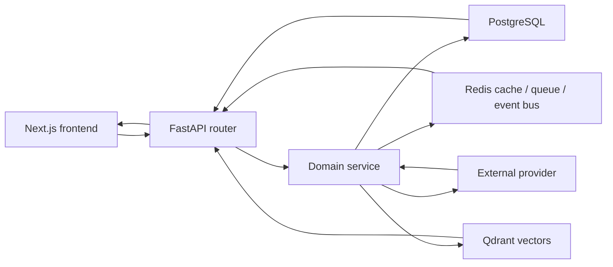
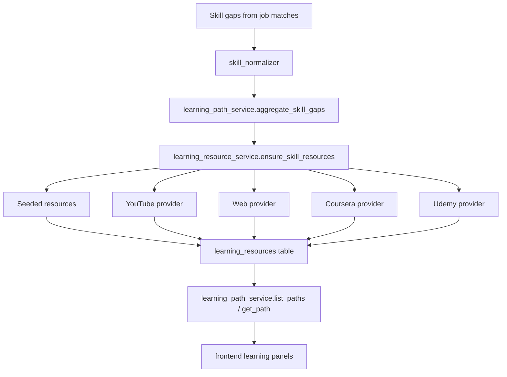
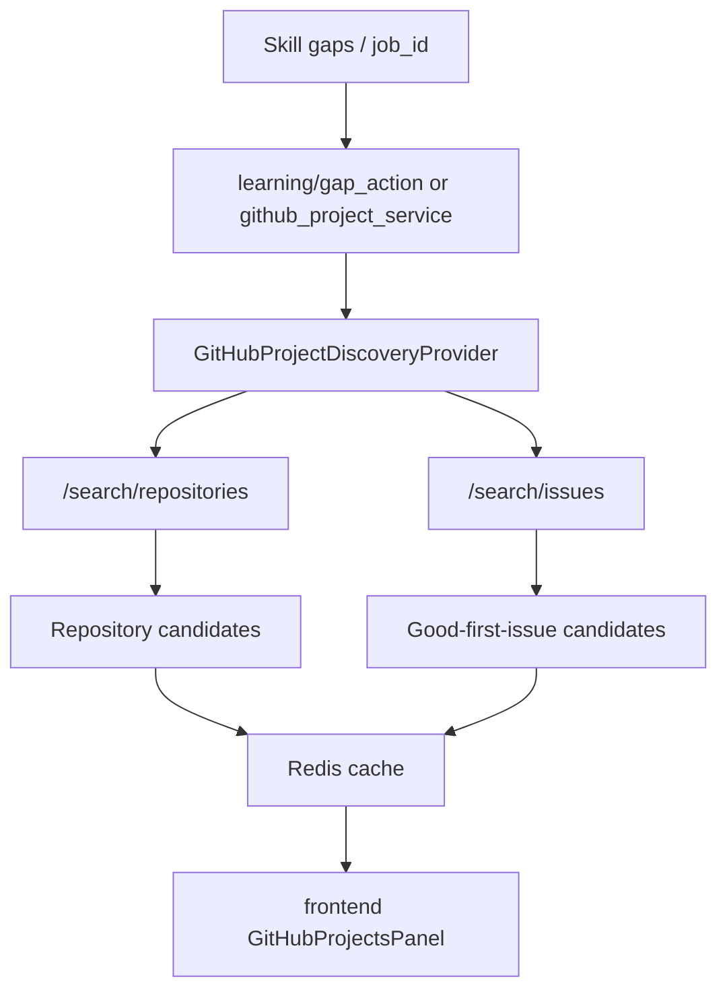
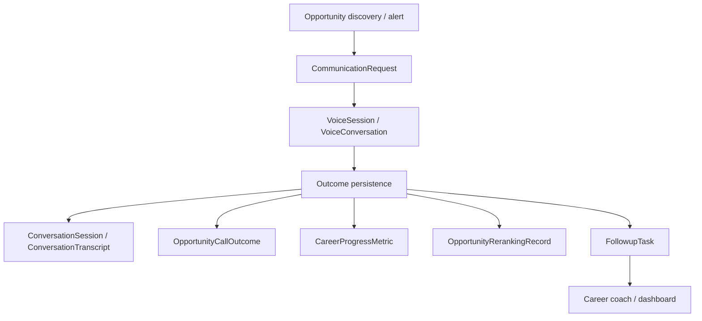
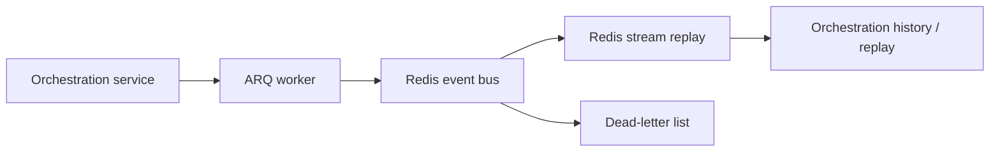
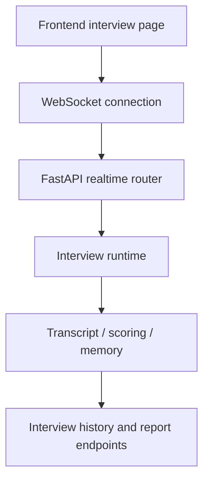

# CareerOS Data Flow

Last verified from source code: 2026-06-19

## 1. High-level request flow

## 2. Learning-resource flow

### What actually happens

- `JobMatch` rows and job extraction data are read from PostgreSQL.
- Missing skills are normalized.
- Seeded resources are loaded first.
- Live providers are called only when enabled by configuration.
- Verified resources are written to `learning_resources`.
- Learning paths and gap actions read the stored resources and generate ordered steps or proof actions.

## 3. GitHub project discovery flow

### What actually happens

- Repo search uses GitHub public search.
- Issue search uses GitHub public issue search.
- Tokens are used when configured; otherwise anonymous search is used.
- Results are ranked and cached, then returned to the frontend.

## 4. Opportunity and outcome flow

### What actually happens

- Opportunity calls and notifications create communication and voice rows.
- Transcript sync stores the conversation transcript separately.
- Outcome intelligence writes funnel and conversion metrics.
- Follow-up and reranking services consume those persisted records.

## 5. Orchestration and event flow

### What actually happens

- Orchestration events are published to Redis streams.
- Event replay reads from the stream by session UID.
- Dead letters are stored for later inspection.

## 6. Interview / realtime flow

### Notes

- Auth is enforced on websocket connect.
- The frontend uses a dedicated websocket hook.
- The runtime keeps transcript and report data separate from the base interview session record.

## 7. Current gaps in the data flow

The request describes future data streams that are not present in the current code:

- resource score history tables
- learning session completion tables
- resource feedback tables
- resource outcome aggregates
- formal graph traversal engine for skills
- explicit replayable event sourcing for all learning actions

Those ideas are reasonable future additions, but they are not current runtime behavior.

