# CareerOS Entity Relationship Map

Last verified from source code: 2026-06-19

## Scope

This is a current-implementation ER map, not a future design proposal. It highlights the entities that are already present in source code and used by services and endpoints.

## 1. Core domain entities

```mermaid
erDiagram
  USER ||--o{ JOB_MATCH : owns
  JOB ||--o{ JOB_MATCH : matched_by
  USER ||--o{ KNOWLEDGE_DOC : uploads
  KNOWLEDGE_DOC ||--o{ RESUME_VERSION : has
  RESUME ||--o{ RESUME_VERSION : has
  RESUME ||--o{ RESUME_CHUNK : split_into
  JOB ||--o{ COMMUNICATION_REQUEST : triggers
  COMMUNICATION_REQUEST ||--o{ VOICE_SESSION : starts
  VOICE_SESSION ||--o{ VOICE_OUTCOME : produces
  VOICE_SESSION ||--o{ VOICE_CONVERSATION : may_have
  VOICE_CONVERSATION ||--o{ APPLICATION_TIMELINE_EVENT : informs
  ROADMAP ||--o{ ROADMAP_GOAL : contains
  ROADMAP_GOAL ||--o{ ROADMAP_TASK : contains
  USER ||--o{ LEARNING_RESOURCE : discovers
  USER ||--o{ USER_SKILL_LEARNING_PATH : owns
  USER_SKILL_LEARNING_PATH ||--o{ LEARNING_PATH_ITEM : contains
  LEARNING_RESOURCE ||--o{ LEARNING_PATH_ITEM : referenced_by
  USER ||--o{ ORCHESTRATION_SESSION : owns
  ORCHESTRATION_SESSION ||--o{ ORCHESTRATION_EVENT : logs
  ORCHESTRATION_SESSION ||--o{ AUTONOMOUS_ACTION : triggers
  ORCHESTRATION_SESSION ||--o{ NOTIFICATION_HISTORY : logs
  ORCHESTRATION_SESSION ||--o{ OPPORTUNITY_SCORE : stores
  ORCHESTRATION_SESSION ||--o{ GOVERNANCE_DECISION : records
  USER ||--o{ CONVERSATION_SESSION : owns
  CONVERSATION_SESSION ||--o{ CONVERSATION_TRANSCRIPT : stores
  CONVERSATION_SESSION ||--o{ OPPORTUNITY_CALL_OUTCOME : produces
  CONVERSATION_SESSION ||--o{ FOLLOWUP_TASK : triggers
  USER ||--o{ APPLICATION_LIFECYCLE : owns
  USER ||--o{ CAREER_PROGRESS_METRIC : owns
  USER ||--o{ OPPORTUNITY_RERANKING_RECORD : owns
```

## 2. Learning tables

| Entity | Table | Important relationships |
|---|---|---|
| `LearningResource` | `learning_resources` | Shared by learning paths and gap actions |
| `UserSkillLearningPath` | `user_skill_learning_paths` | Belongs to a user and a skill slug |
| `LearningPathItem` | `learning_path_items` | Links a learning path to one resource step |

### Learning relationship summary

- `LearningResource` is the canonical stored resource row.
- `UserSkillLearningPath` stores one path per user per skill.
- `LearningPathItem` attaches resources and practice steps to a path.

## 3. Job and opportunity tables

| Entity | Table | Important relationships |
|---|---|---|
| `Job` | `jobs` | Parent for matches, opportunities, lifecycle records |
| `JobMatch` | `job_matches` | Links a user and a job with score/gaps |
| `CommunicationRequest` | `communication_requests` | Tracks outbound communication attempts |
| `VoiceSession` | `voice_sessions` | Tracks voice call state |
| `VoiceConversation` | `voice_conversations` | Tracks conversation state and conversation id |
| `VoiceOutcome` | `voice_outcomes` | Stores classified call outcomes |
| `OpportunityConversationContext` | `opportunity_conversation_contexts` | Stores caller context |
| `OpportunityOutcomeEvent` | `opportunity_outcome_events` | Funnel event log |
| `OpportunityOutcomeMetric` | `opportunity_outcome_metrics` | Aggregated metrics |
| `OpportunityConversionMetric` | `opportunity_conversion_metrics` | Channel conversion metrics |
| `OpportunityLifecycleRun` | `opportunity_lifecycle_runs` | Run tracking |

### Opportunity relationship summary

- Job discovery creates `Job` rows.
- Matching writes `JobMatch`.
- Notification and call flows create `CommunicationRequest` and `VoiceSession`.
- Outcome intelligence persists call/conversion evidence separately from the base job record.

## 4. Outcome intelligence tables

| Entity | Table | Purpose |
|---|---|---|
| `ConversationSession` | `conversation_sessions` | Conversation/call session registry |
| `ConversationTranscript` | `conversation_transcripts` | Transcript + speaker turns |
| `CandidateConcern` | `candidate_concerns` | Structured concern extraction |
| `CandidatePreferenceMemory` | `candidate_preference_memory` | Learned preferences |
| `OpportunityCallOutcome` | `opportunity_call_outcomes` | Final outcome classification |
| `ConversationSyncJob` | `conversation_sync_jobs` | Transcript sync state |
| `FollowupTask` | `followup_tasks` | Follow-up actions |
| `ApplicationLifecycle` | `application_lifecycle` | Candidate application state |
| `CareerProgressMetric` | `career_progress_metrics` | Conversion and progress metrics |
| `OpportunityRerankingRecord` | `opportunity_reranking_records` | Re-ranking explanation and score |
| `ApplicationLifecycleAudit` | `application_lifecycle_audit` | State audit trail |
| `CandidatePreferenceHistory` | `candidate_preference_history` | Change history |
| `CareerCoachPlan` | `career_coach_plans` | Plan generation |
| `CareerCoachGoal` | `career_coach_goals` | Goal tracking |
| `CareerCoachRecommendation` | `career_coach_recommendations` | Weekly recommendations |
| `LearningLoopRun` | `learning_loop_runs` | Learning loop run tracking |

### Outcome relationship summary

- `ConversationSession` is the anchor record for a call or conversation.
- `ConversationTranscript` stores the full transcript for a conversation id.
- `OpportunityCallOutcome` stores the final classification outcome.
- `FollowupTask` and reranking tables consume the classified outcome.

## 5. Roadmap tables

| Entity | Table | Purpose |
|---|---|---|
| `Roadmap` | `roadmaps` | Main roadmap record |
| `RoadmapGoal` | `roadmap_goals` | Goal rows |
| `RoadmapTask` | `roadmap_tasks` | Task rows attached to a goal |

### Roadmap relationship summary

- One roadmap contains multiple goals.
- One goal contains multiple tasks.
- Progress telemetry is currently derived from stored task completion and labeled honestly when tracking is missing.

## 6. Orchestration tables

| Entity | Table | Purpose |
|---|---|---|
| `OrchestrationSession` | `orchestration_sessions` | Session root |
| `OrchestrationEvent` | `orchestration_events` | Event log |
| `AutonomousAction` | `autonomous_actions` | Autonomy attempts |
| `NotificationHistory` | `notification_history` | Notification audit |
| `OpportunityScore` | `opportunity_scores` | Scoring output |
| `GovernanceDecision` | `governance_decisions` | Human/agent governance record |
| `MCPExecutionLog` | `mcp_execution_logs` | Tool execution log |

## 7. Supporting tables

Other current tables include:

- `users`
- `knowledge_docs`
- `interview_sessions`
- `interview_questions`
- `interview_weakness_history`
- `approvals`
- `approval_items`
- `approval_comments`
- `approval_notifications`
- `evaluation_runs`
- `hallucination_audits`
- `user_preferences`
- `generated_packages`
- `package_versions`
- `rerank_runs`
- `resumes`
- `resume_versions`
- `resume_chunks`
- `circuit_states`
- `audit_logs`
- `pending_jobs`

## 8. Skill graph tables

| Entity | Table | Purpose |
|---|---|---|
| `SkillGraphNode` | `skill_graph_nodes` | Canonical skill node registry |
| `SkillGraphAlias` | `skill_graph_aliases` | Alternate names and normalized aliases |
| `SkillGraphEdge` | `skill_graph_edges` | Skill-to-skill relationships |
| `SkillGraphEvidence` | `skill_graph_evidence` | Evidence rows tied to canonical skills |
| `SkillGraphImportRun` | `skill_graph_import_runs` | Import history and audit record |
| `UserSkillState` | `user_skill_states` | Per-user skill state snapshot |

## 9. What is not in the current schema

The request mentions several tables that are not present in the current implementation:

- `resource_score_history`
- a richer skill graph traversal / recommendation engine
- explicit user-owned GitHub ingestion tables
- manual resource curation workflow tables
- a full explainable resource-scoring pipeline with persisted breakdown rows

Those are future design ideas, not current tables.
