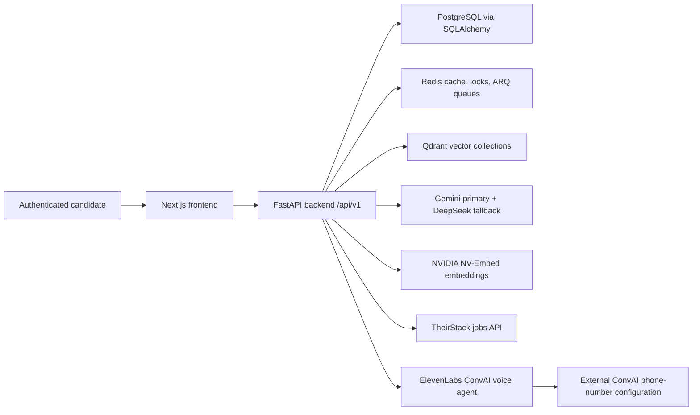

# System Architecture

CareerOS uses a browser frontend, FastAPI API layer, PostgreSQL database, Redis cache/queue, Qdrant vector store, external LLM/embedding providers, job providers, and optional communication providers.

## Persistence Boundaries

PostgreSQL stores users, knowledge documents, resume chunks, jobs, matches, packages, interview sessions, orchestration sessions, communications, voice sessions, transcripts, learning records, and audit/governance records. Qdrant stores vectors and payload metadata for resumes, jobs, knowledge, and docs-RAG chunks. Redis stores caches, locks, streams, backpressure state, and worker queue data.

## Common Questions This Document Answers

- What is implemented in CareerOS for this area?
- Which frontend, backend, data model, and integration files are source of truth?
- Which parts are implemented, partial, mocked, configured but unused, or not found?

## Verified Source Files

- `backend/src/main.py`
- `backend/src/core/config.py`
- `docker-compose.yml`

## Implementation Gaps and Limitations

- Claims are limited to repository evidence inspected on 2026-07-19.
- External dashboards for ElevenLabs, Twilio, Make.com, Pipedream, TheirStack, and hosting were not available and are marked `EXTERNAL_CONFIGURATION_NOT_AVAILABLE` where relevant.
