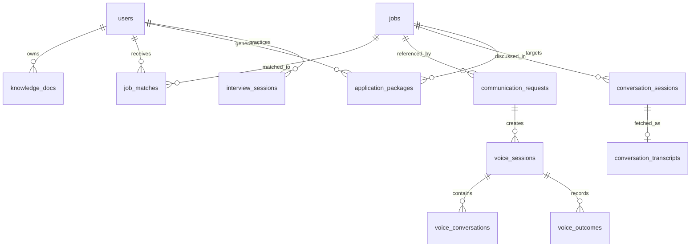

# Database And Data Models

CareerOS uses SQLAlchemy ORM models and Alembic migrations to define PostgreSQL persistence. The repository contains 87 model classes with `__tablename__` values.

## Table Inventory

| Table | ORM class | Source | Important fields |
| --- | --- | --- | --- |
| `approvals` | `Approval` | `backend/src/models/approvals.py` | `id`, `approval_uid`, `user_id`, `title`, `channel`, `status`, `draft_content`, `final_content`, `auto_generated`, `confidence`, `execution_status`, `execution_result`, `created_by`, `updated_by`, `deleted_at`, `created_at`, `updated_at`, `items` ... |
| `approval_items` | `ApprovalItem` | `backend/src/models/approvals.py` | `id`, `approval_id`, `item_type`, `content`, `metadata_`, `order_index`, `deleted_at`, `created_at`, `approval` |
| `approval_comments` | `ApprovalComment` | `backend/src/models/approvals.py` | `id`, `approval_id`, `user_id`, `comment_text`, `deleted_at`, `created_at`, `approval` |
| `approval_notifications` | `ApprovalNotification` | `backend/src/models/approvals.py` | `id`, `user_id`, `notification_type`, `title`, `body`, `read`, `related_approval_id`, `deleted_at`, `created_at` |
| `career_events` | `CareerEvent` | `backend/src/models/career_events.py` | `id`, `event_uid`, `event_type`, `user_id`, `entity_type`, `entity_id`, `source_service`, `source_table`, `source_id`, `event_time`, `payload_json`, `evidence_json`, `confidence`, `trace_id`, `request_id`, `provider`, `status`, `schema_version` ... |
| `evaluation_runs` | `EvaluationRun` | `backend/src/models/evaluation_prefs.py` | `id`, `run_uid`, `user_id`, `benchmark_name`, `status`, `progress_pct`, `metrics`, `results`, `errors`, `trace_id`, `created_by`, `updated_by`, `deleted_at`, `created_at`, `completed_at` |
| `hallucination_audits` | `HallucinationAudit` | `backend/src/models/evaluation_prefs.py` | `id`, `user_id`, `run_id`, `input_text`, `output_text`, `is_hallucination`, `confidence`, `keywords_detected`, `deleted_at`, `created_at` |
| `user_preferences` | `UserPreferences` | `backend/src/models/evaluation_prefs.py` | `id`, `user_id`, `notification_email`, `alert_threshold`, `quiet_hours_start`, `quiet_hours_end`, `theme`, `language`, `extra`, `deleted_at`, `created_at`, `updated_at` |
| `interview_sessions` | `InterviewSession` | `backend/src/models/interview.py` |  |
| `interview_questions` | `InterviewQuestion` | `backend/src/models/interview.py` |  |
| `interview_weakness_history` | `InterviewWeaknessHistory` | `backend/src/models/interview.py` |  |
| `jobs` | `Job` | `backend/src/models/jobs.py` | `id`, `job_uid`, `title`, `company`, `location`, `description`, `source`, `source_provider`, `source_job_id`, `source_url`, `apply_url`, `posted_date`, `fetched_at`, `original_provider_metadata`, `freshness_score`, `freshness_bucket`, `provider_quality_score`, `salary_quality_score` ... |
| `job_matches` | `JobMatch` | `backend/src/models/jobs.py` | `id`, `user_id`, `job_id`, `source_job_id`, `source_provider`, `source_url`, `ingested_at`, `overall_score`, `skill_match`, `experience_match`, `education_match`, `gap_score`, `strengths`, `gaps`, `match_details`, `resume_doc_uid`, `resume_name`, `recommendation` ... |
| `opportunity_notifications` | `OpportunityNotification` | `backend/src/models/jobs.py` | `id`, `user_id`, `job_id`, `channel`, `status`, `sent_at`, `viewed_at`, `applied_at`, `send_count`, `metadata_`, `created_at`, `updated_at` |
| `opportunity_intelligence_reports` | `OpportunityIntelligenceReport` | `backend/src/models/jobs.py` | `id`, `user_id`, `job_id`, `resume_doc_uid`, `match_score`, `skill_gap_score`, `learning_effort_score`, `application_urgency`, `competition_risk`, `domain_alignment`, `career_growth_potential`, `salary_potential`, `remote_compatibility`, `opportunity_rank_score`, `recommended_priority`, `report`, `evidence`, `created_at` ... |
| `salary_intelligence` | `SalaryIntelligence` | `backend/src/models/jobs.py` | `id`, `job_id`, `salary_min`, `salary_max`, `salary_currency`, `salary_period`, `monthly_min`, `monthly_max`, `yearly_min`, `yearly_max`, `salary_confidence`, `source`, `evidence`, `created_at`, `updated_at` |
| `interview_preparation_plans` | `InterviewPreparationPlan` | `backend/src/models/jobs.py` | `id`, `user_id`, `job_id`, `resume_doc_uid`, `technical_questions`, `hr_questions`, `system_design_questions`, `coding_topics`, `preparation_plan`, `evidence`, `created_at`, `updated_at` |
| `application_timeline_events` | `ApplicationTimelineEvent` | `backend/src/models/jobs.py` | `id`, `user_id`, `job_id`, `status`, `event_type`, `notes`, `metadata_`, `created_at` |
| `career_memory` | `CareerMemory` | `backend/src/models/jobs.py` | `id`, `user_id`, `event_type`, `job_id`, `source_table`, `source_id`, `title`, `data`, `created_at` |
| `alert_decision_audits` | `AlertDecisionAudit` | `backend/src/models/jobs.py` | `id`, `user_id`, `job_id`, `decision`, `channel`, `reason`, `scores`, `evidence`, `decision_factors`, `decision_confidence`, `created_at` |
| `communication_requests` | `CommunicationRequest` | `backend/src/models/jobs.py` | `id`, `request_uid`, `correlation_id`, `user_id`, `job_id`, `opportunity_id`, `channel`, `communication_status`, `communication_provider`, `communication_result`, `delivery_attempts`, `decision_reason`, `decision_factors`, `decision_confidence`, `pipedream_request`, `pipedream_response`, `webhook_status`, `created_at` ... |
| `voice_sessions` | `VoiceSession` | `backend/src/models/jobs.py` | `id`, `session_uid`, `communication_request_id`, `user_id`, `job_id`, `status`, `voice_provider`, `voice_metadata`, `created_at`, `updated_at` |
| `voice_conversations` | `VoiceConversation` | `backend/src/models/jobs.py` | `id`, `voice_session_id`, `role`, `content`, `intelligence_snapshot`, `created_at` |
| `voice_outcomes` | `VoiceOutcome` | `backend/src/models/jobs.py` | `id`, `voice_session_id`, `outcome`, `provider_status`, `call_sid`, `data`, `created_at` |
| `opportunity_conversation_contexts` | `OpportunityConversationContext` | `backend/src/models/jobs.py` | `id`, `context_uid`, `user_id`, `job_id`, `conversation_context`, `context_sources`, `context_confidence`, `created_at` |
| `opportunity_outcome_events` | `OpportunityOutcomeEvent` | `backend/src/models/jobs.py` | `id`, `event_uid`, `user_id`, `job_id`, `communication_request_id`, `status`, `channel`, `data`, `created_at` |
| `opportunity_outcome_metrics` | `OpportunityOutcomeMetric` | `backend/src/models/jobs.py` | `id`, `user_id`, `metric_name`, `metric_value`, `dimensions`, `calculated_at` |
| `opportunity_conversion_metrics` | `OpportunityConversionMetric` | `backend/src/models/jobs.py` | `id`, `user_id`, `channel`, `notified_count`, `applied_count`, `interview_count`, `offer_count`, `conversion_rate`, `calculated_at` |
| `opportunity_lifecycle_runs` | `OpportunityLifecycleRun` | `backend/src/models/jobs.py` | `id`, `run_uid`, `user_id`, `status`, `monitored_counts`, `triggered_actions`, `errors`, `created_at` |
| `knowledge_docs` | `KnowledgeDoc` | `backend/src/models/knowledge.py` | `id`, `doc_uid`, `user_id`, `title`, `content`, `summary`, `source`, `chunk_count`, `status`, `analysis_results`, `created_by`, `updated_by`, `deleted_at`, `created_at`, `updated_at` |
| `learning_resources` | `LearningResource` | `backend/src/models/learning.py` | `id`, `skill_slug`, `skill_name`, `title`, `provider`, `source_type`, `source_url`, `channel_name`, `duration_minutes`, `difficulty`, `format`, `is_free`, `language`, `trust_score`, `relevance_score`, `freshness_score`, `last_verified_at`, `metadata_` ... |
| `user_skill_learning_paths` | `UserSkillLearningPath` | `backend/src/models/learning.py` | `id`, `user_id`, `skill_slug`, `skill_name`, `source_job_id`, `job_match_id`, `priority`, `reason`, `status`, `estimated_hours`, `resource_status`, `message`, `evidence`, `generated_at`, `refreshed_at`, `created_at`, `updated_at`, `items` |
| `learning_path_items` | `LearningPathItem` | `backend/src/models/learning.py` | `id`, `learning_path_id`, `resource_id`, `order_index`, `step_type`, `reason`, `estimated_minutes`, `practice_project`, `created_at`, `learning_path`, `resource` |
| `learning_resource_discovery_runs` | `ResourceDiscoveryRun` | `backend/src/models/learning.py` | `id`, `run_uid`, `user_id`, `skill_slug`, `skill_name`, `provider`, `source_type`, `status`, `candidate_count`, `stored_count`, `request_payload`, `response_payload`, `error_message`, `evidence`, `started_at`, `completed_at`, `created_at`, `updated_at` ... |
| `learning_resource_provenance_records` | `ResourceProvenanceRecord` | `backend/src/models/learning.py` | `id`, `provenance_uid`, `resource_id`, `discovery_run_id`, `user_id`, `job_id`, `skill_slug`, `skill_name`, `source_entity_type`, `source_entity_id`, `provenance_type`, `title`, `source_url`, `provider`, `source_table`, `source_pk`, `trust_score`, `relevance_score` ... |
| `learning_sessions` | `LearningSession` | `backend/src/models/learning.py` | `id`, `session_uid`, `user_id`, `resource_id`, `provenance_uid`, `path_id`, `path_item_id`, `skill_slug`, `job_id`, `status`, `source_ui`, `external_resource_url`, `started_at`, `last_activity_at`, `ended_at`, `duration_seconds`, `completion_percentage`, `metadata_` ... |
| `resource_feedback` | `ResourceFeedback` | `backend/src/models/learning.py` | `id`, `feedback_uid`, `user_id`, `resource_id`, `provenance_uid`, `session_uid`, `skill_slug`, `rating`, `difficulty`, `would_recommend`, `comment`, `helpfulness_score`, `outcome_tag`, `metadata_`, `created_at`, `updated_at`, `resource`, `session` |
| `resource_outcomes` | `ResourceOutcome` | `backend/src/models/learning.py` | `id`, `resource_id`, `provenance_uid`, `skill_slug`, `source_type`, `provider`, `completion_count`, `started_count`, `feedback_count`, `average_rating`, `completion_rate`, `drop_off_rate`, `recommendation_rate`, `average_completion_percentage`, `average_duration_seconds`, `last_calculated_at`, `status`, `calculation_metadata_json` ... |
| `learning_activity_events` | `LearningActivityEvent` | `backend/src/models/learning.py` | `id`, `activity_uid`, `user_id`, `event_type`, `resource_id`, `provenance_uid`, `session_uid`, `path_id`, `path_item_id`, `skill_slug`, `job_id`, `payload_json`, `event_time`, `created_at`, `resource` |
| `opportunity_alerts` | `OpportunityAlert` | `backend/src/models/opportunity_alert.py` | `id`, `candidate_id`, `job_title`, `company`, `match_score`, `hours_since_posted`, `decision`, `reason`, `called`, `call_sid`, `webhook_status`, `provider_response`, `created_at` |
| `orchestration_sessions` | `OrchestrationSession` | `backend/src/models/orchestration.py` | `id`, `session_uid`, `user_id`, `graph_name`, `status`, `current_node`, `completion_pct`, `errors`, `metadata_`, `created_by`, `updated_by`, `deleted_at`, `created_at`, `updated_at`, `events` |
| `orchestration_events` | `OrchestrationEvent` | `backend/src/models/orchestration.py` | `id`, `event_uid`, `session_id`, `event_type`, `node_name`, `agent_name`, `payload`, `status`, `retry_count`, `duration_ms`, `deleted_at`, `created_at`, `session` |
| `autonomous_actions` | `AutonomousAction` | `backend/src/models/orchestration.py` | `id`, `action_uid`, `session_id`, `user_id`, `action_type`, `status`, `confidence`, `reasoning_chain`, `evidence_chain`, `governance_verdict`, `suppressed`, `suppression_reason`, `mcp_tool_used`, `mcp_result`, `trace_id`, `deleted_at`, `created_at` |
| `notification_history` | `NotificationHistory` | `backend/src/models/orchestration.py` | `id`, `notification_uid`, `user_id`, `opportunity_id`, `channel`, `status`, `voice_script`, `elevenlabs_result`, `twilio_result`, `call_sid`, `call_duration_seconds`, `urgency_score`, `suppressed`, `suppression_reason`, `trace_id`, `deleted_at`, `created_at` |
| `opportunity_scores` | `OpportunityScore` | `backend/src/models/orchestration.py` | `id`, `opportunity_id`, `user_id`, `session_id`, `overall_score`, `confidence`, `dimension_scores`, `dimension_weights`, `evidence_citations`, `reasoning`, `priority_rank`, `urgency_score`, `generated_by`, `trace_id`, `deleted_at`, `created_at` |
| `governance_decisions` | `GovernanceDecision` | `backend/src/models/orchestration.py` | `id`, `session_id`, `action_id`, `decision_type`, `verdict`, `rule_violated`, `confidence_before`, `confidence_after`, `penalty_applied`, `reason`, `evidence`, `deleted_at`, `created_at` |
| `mcp_execution_logs` | `MCPExecutionLog` | `backend/src/models/orchestration.py` | `id`, `execution_uid`, `session_id`, `action_id`, `tool_name`, `server_name`, `status`, `attempt`, `request_payload`, `response_payload`, `error_message`, `duration_ms`, `trace_id`, `deleted_at`, `created_at` |
| `conversation_sessions` | `ConversationSession` | `backend/src/models/outcome_intelligence.py` | `id`, `candidate_id`, `job_id`, `conversation_id`, `call_sid`, `agent_id`, `job_title`, `company`, `started_at`, `ended_at`, `duration_seconds`, `status`, `created_at` |
| `conversation_transcripts` | `ConversationTranscript` | `backend/src/models/outcome_intelligence.py` | `id`, `conversation_id`, `candidate_id`, `raw_transcript`, `speaker_turns`, `provider_metadata`, `created_at`, `updated_at` |
| `candidate_concerns` | `CandidateConcern` | `backend/src/models/outcome_intelligence.py` | `id`, `candidate_id`, `conversation_id`, `concern_type`, `confidence`, `evidence`, `created_at` |
| `candidate_preference_memory` | `CandidatePreferenceMemory` | `backend/src/models/outcome_intelligence.py` | `id`, `candidate_id`, `preference_type`, `preference_value`, `confidence`, `evidence`, `source_conversation_id`, `created_at`, `updated_at` |
| `opportunity_call_outcomes` | `OpportunityCallOutcome` | `backend/src/models/outcome_intelligence.py` | `id`, `candidate_id`, `job_id`, `conversation_id`, `call_sid`, `outcome`, `interest_level`, `primary_concern`, `followup_required`, `summary`, `confidence`, `created_at` |
| `conversation_sync_jobs` | `ConversationSyncJob` | `backend/src/models/outcome_intelligence.py` | `id`, `conversation_id`, `status`, `retry_count`, `last_attempt_at`, `completed_at`, `error_message`, `created_at` |
| `followup_tasks` | `FollowupTask` | `backend/src/models/outcome_intelligence.py` | `id`, `candidate_id`, `job_id`, `conversation_id`, `action`, `status`, `scheduled_for`, `executed_at`, `result`, `created_at` |
| `application_lifecycle` | `ApplicationLifecycle` | `backend/src/models/outcome_intelligence.py` | `id`, `candidate_id`, `job_id`, `state`, `reason`, `confidence`, `updated_at`, `created_at` |
| `career_progress_metrics` | `CareerProgressMetric` | `backend/src/models/outcome_intelligence.py` | `id`, `candidate_id`, `dimension`, `dimension_value`, `engagement_count`, `conversion_count`, `conversion_rate`, `calculated_at` |
| `opportunity_reranking_records` | `OpportunityRerankingRecord` | `backend/src/models/outcome_intelligence.py` | `id`, `candidate_id`, `job_id`, `existing_match_score`, `memory_affinity_score`, `outcome_success_score`, `final_opportunity_ranking`, `explanation`, `created_at` |
| `application_lifecycle_audit` | `ApplicationLifecycleAudit` | `backend/src/models/outcome_intelligence.py` | `id`, `candidate_id`, `job_id`, `from_state`, `to_state`, `reason`, `confidence`, `actor`, `metadata_json`, `created_at` |
| `candidate_preference_history` | `CandidatePreferenceHistory` | `backend/src/models/outcome_intelligence.py` | `id`, `candidate_id`, `preference_type`, `preference_value`, `confidence`, `evidence`, `source_conversation_id`, `action`, `created_at` |
| `career_coach_plans` | `CareerCoachPlan` | `backend/src/models/outcome_intelligence.py` | `id`, `user_id`, `plan_type`, `title`, `description`, `items`, `status`, `generated_at`, `expires_at`, `metadata_json` |
| `career_coach_goals` | `CareerCoachGoal` | `backend/src/models/outcome_intelligence.py` | `id`, `user_id`, `goal_type`, `title`, `description`, `target_value`, `current_value`, `unit`, `status`, `priority`, `deadline`, `created_at`, `updated_at` |
| `career_coach_recommendations` | `CareerCoachRecommendation` | `backend/src/models/outcome_intelligence.py` | `id`, `user_id`, `category`, `title`, `description`, `priority`, `action_url`, `status`, `week_of`, `created_at` |
| `learning_loop_runs` | `LearningLoopRun` | `backend/src/models/outcome_intelligence.py` | `id`, `user_id`, `run_id`, `job_id`, `status`, `steps_completed`, `current_step`, `error`, `started_at`, `completed_at`, `metadata_json` |
| `generated_packages` | `GeneratedPackage` | `backend/src/models/package.py` | `id`, `package_uid`, `user_id`, `job_id`, `title`, `resume_tailored`, `cover_letter`, `outreach_message`, `interview_guide`, `readiness_summary`, `status`, `metadata_`, `created_by`, `updated_by`, `deleted_at`, `created_at`, `updated_at` |
| `package_versions` | `PackageVersion` | `backend/src/models/package_version.py` | `id`, `package_id`, `version_num`, `change_reason`, `resume_content`, `cover_letter_content`, `outreach_content`, `interview_guide_content`, `created_by`, `created_at` |
| `generated_reports` | `GeneratedReport` | `backend/src/models/report.py` | `id`, `report_uid`, `user_id`, `report_type`, `title`, `version`, `format`, `summary`, `payload`, `storage_path`, `content_type`, `status`, `created_at`, `deleted_at` |
| `rerank_runs` | `RerankRun` | `backend/src/models/rerank.py` | `id`, `user_id`, `query`, `chunks_submitted`, `chunks_returned`, `primary_provider`, `primary_success`, `primary_latency_ms`, `fallback_used`, `fallback_strategy`, `fallback_reason`, `circuit_breaker_open`, `retry_count`, `confidence_avg`, `score_distribution`, `rank_correlation`, `rank_inversion_rate`, `boost_skills_applied` ... |
| `resumes` | `Resume` | `backend/src/models/resume.py` | `id`, `user_id`, `filename`, `storage_path`, `status`, `error_message`, `task_id`, `metadata_`, `created_by`, `updated_by`, `deleted_at`, `created_at`, `updated_at` |
| `resume_versions` | `ResumeVersion` | `backend/src/models/resume.py` | `id`, `resume_id`, `version_num`, `raw_content`, `masked_content`, `normalized_content`, `deleted_at`, `created_at` |
| `resume_chunks` | `ResumeChunk` | `backend/src/models/resume.py` | `id`, `version_id`, `chunk_index`, `content`, `metadata_`, `deleted_at`, `created_at` |
| `roadmaps` | `Roadmap` | `backend/src/models/roadmap.py` | `id`, `roadmap_uid`, `user_id`, `title`, `target_role`, `target_salary`, `target_location`, `target_timeline`, `status`, `progress_pct`, `recommendations`, `velocity_history`, `trace_id`, `created_by`, `updated_by`, `deleted_at`, `created_at`, `updated_at` ... |
| `roadmap_goals` | `RoadmapGoal` | `backend/src/models/roadmap.py` | `id`, `roadmap_id`, `title`, `description`, `category`, `priority`, `order_index`, `deleted_at`, `created_at`, `roadmap`, `tasks` |
| `roadmap_tasks` | `RoadmapTask` | `backend/src/models/roadmap.py` | `id`, `task_uid`, `goal_id`, `title`, `description`, `completed`, `due_date`, `order_index`, `deleted_at`, `created_at`, `updated_at`, `goal` |
| `skill_gap_analysis_runs` | `SkillGapAnalysisRun` | `backend/src/models/skill_gap.py` | `id`, `run_uid`, `user_id`, `job_id`, `target_role_slug`, `source_scope`, `source_service`, `status`, `started_at`, `completed_at`, `duration_ms`, `required_skill_count`, `missing_skill_count`, `evidenced_skill_count`, `learning_skill_count`, `validated_skill_count`, `insufficient_data_count`, `confidence` ... |
| `skill_gap_findings` | `SkillGapFinding` | `backend/src/models/skill_gap.py` | `id`, `finding_uid`, `run_uid`, `user_id`, `job_id`, `skill_node_uid`, `skill_slug`, `skill_name`, `required_by_type`, `required_by_id`, `gap_status`, `confidence`, `evidence_count`, `missing_evidence_json`, `reason_summary`, `recommendation_summary`, `calculation_metadata_json`, `created_at` ... |
| `skill_gap_finding_evidence` | `SkillGapFindingEvidence` | `backend/src/models/skill_gap.py` | `id`, `evidence_uid`, `finding_uid`, `user_id`, `skill_slug`, `evidence_type`, `source_table`, `source_id`, `source_url`, `evidence_strength`, `supports_status`, `quote_or_snippet`, `metadata_json`, `confidence`, `created_at` |
| `user_skill_gap_snapshots` | `UserSkillGapSnapshot` | `backend/src/models/skill_gap.py` | `id`, `snapshot_uid`, `user_id`, `target_role_slug`, `job_id`, `run_uid`, `summary_json`, `missing_count`, `learning_count`, `evidenced_count`, `validated_count`, `insufficient_data_count`, `created_at` |
| `skill_graph_nodes` | `SkillGraphNode` | `backend/src/models/skill_graph.py` | `id`, `skill_slug`, `skill_name`, `category`, `status`, `evidence_count`, `source_count`, `user_count`, `demand_count`, `supply_count`, `trust_score`, `relevance_score`, `freshness_score`, `confidence_score`, `first_seen_at`, `last_seen_at`, `last_import_run_uid`, `metadata_` ... |
| `skill_graph_aliases` | `SkillGraphAlias` | `backend/src/models/skill_graph.py` | `id`, `alias_uid`, `skill_node_id`, `raw_value`, `normalized_value`, `source_entity_type`, `source_entity_id`, `source_field`, `source_table`, `source_pk`, `provider`, `alias_type`, `metadata_`, `created_at`, `updated_at`, `skill_node` |
| `skill_graph_edges` | `SkillGraphEdge` | `backend/src/models/skill_graph.py` | `id`, `edge_uid`, `source_skill_node_id`, `target_skill_node_id`, `edge_type`, `source_entity_type`, `source_entity_id`, `source_table`, `source_pk`, `source_title`, `provider`, `weight`, `evidence_count`, `confidence_score`, `relation_summary`, `metadata_`, `first_seen_at`, `last_seen_at` ... |
| `skill_graph_evidence` | `SkillGraphEvidence` | `backend/src/models/skill_graph.py` | `id`, `evidence_uid`, `skill_node_id`, `edge_id`, `source_entity_type`, `source_entity_id`, `source_table`, `source_pk`, `source_field`, `source_title`, `source_url`, `provider`, `evidence_kind`, `raw_value`, `normalized_value`, `trust_score`, `relevance_score`, `freshness_score` ... |
| `skill_graph_import_runs` | `SkillGraphImportRun` | `backend/src/models/skill_graph.py` | `id`, `run_uid`, `user_id`, `scope`, `status`, `strategy`, `node_count`, `edge_count`, `evidence_count`, `alias_count`, `user_state_count`, `source_counts`, `notes`, `error_message`, `metadata_`, `started_at`, `completed_at`, `created_at` ... |
| `user_skill_states` | `UserSkillState` | `backend/src/models/skill_graph.py` | `id`, `state_uid`, `user_id`, `skill_node_id`, `status`, `confidence_score`, `evidence_count`, `demand_count`, `supply_count`, `learning_signal_count`, `resume_signal_count`, `started_count`, `completion_count`, `feedback_count`, `average_rating`, `last_activity_at`, `last_import_run_uid`, `recommended_action` ... |
| `circuit_states` | `CircuitState` | `backend/src/models/troubleshoot.py` | `id`, `circuit_uid`, `name`, `service`, `state`, `failure_count`, `last_failure`, `last_success`, `metadata_`, `deleted_at`, `created_at`, `updated_at` |
| `audit_logs` | `AuditLog` | `backend/src/models/troubleshoot.py` | `id`, `user_id`, `action`, `resource`, `resource_id`, `details`, `ip_address`, `severity`, `deleted_at`, `created_at` |
| `pending_jobs` | `PendingJob` | `backend/src/models/troubleshoot.py` | `id`, `job_uid`, `job_type`, `status`, `priority`, `payload`, `retry_count`, `max_retries`, `error_message`, `scheduled_at`, `completed_at`, `created_by`, `deleted_at`, `created_at`, `updated_at` |
| `users` | `User` | `backend/src/models/user.py` | `id`, `email`, `password_hash`, `full_name`, `role`, `failed_login_attempts`, `locked_until`, `deleted_at`, `created_at`, `updated_at` |

## Verified ER Diagram

## Transcript Storage Tables

Transcript storage is `PARTIALLY_IMPLEMENTED`. `voice_sessions`, `voice_conversations`, and `voice_outcomes` store CareerOS voice-session lifecycle metadata and conversation turns. `conversation_sessions`, `conversation_transcripts`, `conversation_sync_jobs`, and `opportunity_call_outcomes` store post-call ElevenLabs conversation IDs, fetched transcript text, speaker turns, sync status, and classified call outcomes. No inbound ElevenLabs callback route was found.

## Common Questions This Document Answers

- What is implemented in CareerOS for this area?
- Which frontend, backend, data model, and integration files are source of truth?
- Which parts are implemented, partial, mocked, configured but unused, or not found?

## Verified Source Files

- `backend/src/models/jobs.py`
- `backend/src/models/outcome_intelligence.py`
- `backend/alembic/versions`

## Implementation Gaps and Limitations

- Claims are limited to repository evidence inspected on 2026-07-19.
- External dashboards for ElevenLabs, Twilio, Make.com, Pipedream, TheirStack, and hosting were not available and are marked `EXTERNAL_CONFIGURATION_NOT_AVAILABLE` where relevant.
