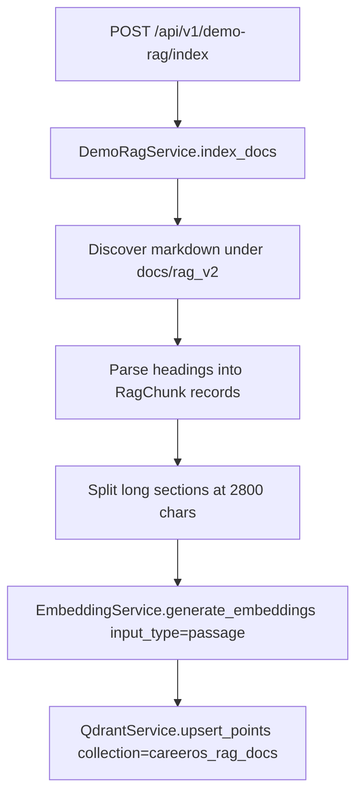
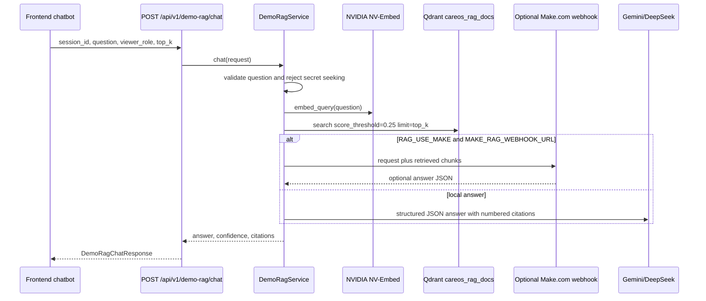

# RAG And Mentor Chatbot

The CareerOS mentor/docs RAG chatbot is implemented by `backend/src/services/rag/service.py` and exposed through `backend/src/api/v1/endpoints/demo_rag.py`. It indexes Markdown documentation from `docs/rag_v2`, embeds chunks with NVIDIA NV-Embed, stores vectors in Qdrant collection `careeros_rag_docs`, retrieves top chunks for a question, optionally relays to Make.com, and otherwise generates a cited answer with Gemini primary and DeepSeek fallback.

## Indexing Flow

## Retrieval And Answer Generation Flow

## Active Configuration

| Setting | Value or behavior | Evidence |
| --- | --- | --- |
| Collection | `careeros_rag_docs` | `backend/src/core/config.py::QDRANT_RAG_DOCS_COLLECTION` |
| Embedding model label | `nvidia/nv-embed-v1` | `backend/src/core/config.py::RAG_EMBEDDING_MODEL` |
| Embedding dimensions | 4096 | `backend/src/services/vector_store/qdrant_service.py::DIMENSIONS` |
| LLM model label | `gemini-2.5-flash` | `backend/src/core/config.py::RAG_LLM_MODEL` |
| Score threshold | 0.25 | `backend/src/services/rag/service.py::DEFAULT_SCORE_THRESHOLD` |
| Top K default | 6 | `backend/src/services/rag/service.py::DEFAULT_TOP_K` |
| Max context chars | 12000 | `backend/src/services/rag/service.py::MAX_CONTEXT_CHARS` |
| Make relay | Optional; falls back to local RAG on failure | `backend/src/services/rag/service.py::_relay_to_make` |

## Common Questions This Document Answers

- What is implemented in CareerOS for this area?
- Which frontend, backend, data model, and integration files are source of truth?
- Which parts are implemented, partial, mocked, configured but unused, or not found?

## Verified Source Files

- `backend/src/services/rag/service.py`
- `backend/src/api/v1/endpoints/demo_rag.py`
- `backend/src/services/vector_store/qdrant_service.py`
- `backend/src/services/embedding/embedding_service.py`
- `frontend/src/lib/demo-rag.ts`

## Implementation Gaps and Limitations

- Claims are limited to repository evidence inspected on 2026-07-19.
- External dashboards for ElevenLabs, Twilio, Make.com, Pipedream, TheirStack, and hosting were not available and are marked `EXTERNAL_CONFIGURATION_NOT_AVAILABLE` where relevant.
