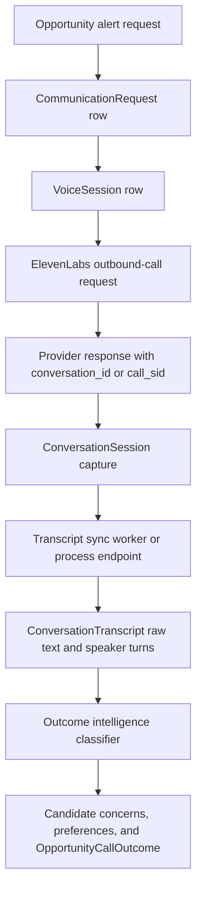

# Voice Agent Data Flow

This document tracks what is actually persisted before, during, and after an outbound opportunity call.

## Data Lifecycle

## Stored Voice And Outcome Tables

- `CommunicationRequest` stores delivery status, provider, payload metadata, and errors.
- `VoiceSession`, `VoiceConversation`, and `VoiceOutcome` store the opportunity voice-session lifecycle.
- `ConversationSession` stores provider conversation identity and correlation IDs.
- `ConversationTranscript` stores raw transcript text, speaker turns, provider payload metadata, and duration.
- `ConversationSyncJob` tracks transcript retry state.
- `CandidateConcern`, `CandidatePreferenceMemory`, and `OpportunityCallOutcome` store extracted post-call intelligence.

## Transcript Retrieval

`ConversationRetrievalAgent.retrieve_and_store` fetches ElevenLabs conversations by `conversation_id`, parses transcript data from the top-level `transcript` field or nested `conversation.transcript`, and writes `ConversationTranscript`. `ElevenLabsTranscriptSyncService.scan` retries missing transcript sessions and records retry or permanent failure state. The Celery task `sync_elevenlabs_transcripts_task` calls this scanner.

## Webhook Status

No inbound ElevenLabs callback/webhook route was found in the repository. Transcript ingestion is implemented as outbound polling/sync and on-demand processing rather than an inbound provider callback.

## Common Questions This Document Answers

- What is implemented in CareerOS for this area?
- Which frontend, backend, data model, and integration files are source of truth?
- Which parts are implemented, partial, mocked, configured but unused, or not found?

## Verified Source Files

- `backend/src/models/jobs.py`
- `backend/src/models/outcome_intelligence.py`
- `backend/src/services/opportunity/conversation_retrieval_agent.py`
- `backend/src/services/opportunity/elevenlabs_transcript_sync.py`
- `backend/src/workers/tasks/autonomous_engagement.py`
- `backend/src/api/v1/endpoints/outcome_intelligence.py`

## Implementation Gaps and Limitations

- Claims are limited to repository evidence inspected on 2026-07-19.
- External dashboards for ElevenLabs, Twilio, Make.com, Pipedream, TheirStack, and hosting were not available and are marked `EXTERNAL_CONFIGURATION_NOT_AVAILABLE` where relevant.
