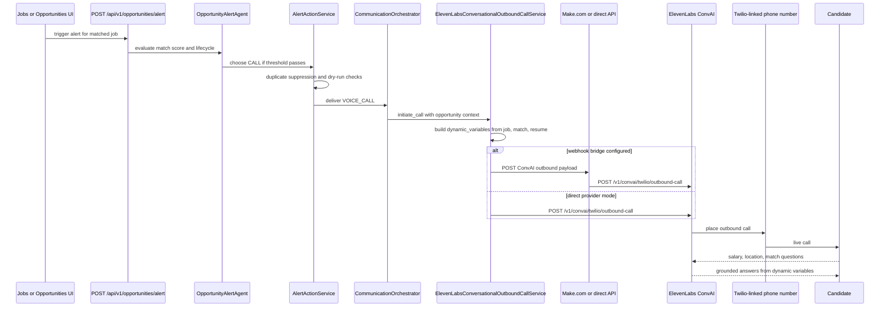

# ElevenLabs Make Twilio Opportunity Call

This is the flagship CareerOS engagement workflow: a high-fit opportunity can trigger a real conversational phone call where Alex explains the job, listens to the candidate, answers questions, and records the outcome.

## Executive Summary

CareerOS does not use static TTS for opportunity calls. The supported live path is ElevenLabs Conversational AI (ConvAI). A high match score reaches `POST /api/v1/opportunities/alert`, passes through `OpportunityAlertAgent`, `AlertActionService`, `CommunicationOrchestrator`, and `ElevenLabsConversationalOutboundCallService`, then starts a ConvAI outbound call. The call is selected when the normalized match score is greater than or equal to `CALL_ALERT_MIN_MATCH_SCORE`, subject to lifecycle, URL, duplicate-suppression, recipient-validation, and dry-run safety checks.

CareerOS shares the JD and match context with ElevenLabs through `conversation_initiation_client_data.dynamic_variables`, including `job_description`, `job_title`, `company`, `location`, `salary_range`, `match_score`, `matching_skills`, `missing_skills`, `deadline`, and `application_url`. ElevenLabs ConvAI uses those variables to answer salary, location, company, deadline, skills, match-reason, and application questions without inventing unavailable facts.

Twilio is the telephony rail connected to the ElevenLabs phone number ID. CareerOS does not use Twilio `Say` or `Play` for this opportunity-agent path. Make.com can act as an external relay into the same ElevenLabs ConvAI outbound-call API, but the repository does not store the exported Make.com scenario. If the configured webhook bridge URL points to Make.com, Make relays the payload; otherwise CareerOS can call ElevenLabs directly.

The live agent can support English and Tamil when the external ElevenLabs agent has both languages and voices configured. The backend normalizes English and Tamil language preferences, while dynamic variables remain language-neutral.

## End-to-End Flow



## Trigger Rules

| Rule | Behavior |
|---|---|
| Match threshold | `CALL` is selected when normalized match score is greater than or equal to `CALL_ALERT_MIN_MATCH_SCORE`. |
| Lower scores | Email and dashboard-only channels can be selected for lower scores. |
| Lifecycle safety | Calls are blocked for states such as applied, interviewing, offered, hired, or expired. |
| URL safety | A source or application URL is required before calling. |
| Duplicate suppression | Existing active communication requests are reused or blocked instead of placing duplicate calls. |
| Dry-run safety | `CALL_ALERT_DRY_RUN=true` or `OUTBOUND_CALL_DRY_RUN=true` returns the payload without placing a live call. |

## Provider And Transport Boundary

| Component | Role |
|---|---|
| CareerOS backend | Decides whether the call should happen and builds the ConvAI payload. |
| Make.com | Optional external relay shown in operator screenshots. It receives the CareerOS payload and posts to ElevenLabs. |
| ElevenLabs ConvAI | The actual live conversational agent provider. |
| Twilio | Telephony infrastructure attached to the ElevenLabs phone number ID. |
| Candidate phone | Receives the live call and speaks with Alex. |

Important implementation detail: the code currently uses `PIPEDREAM_WEBHOOK_URL` as the generic webhook bridge URL for voice payload relay. If that value points to a Make.com custom webhook, Make.com is the relay. If no bridge URL is configured, the backend calls ElevenLabs directly with `ELEVENLABS_API_KEY`.

## ConvAI Outbound Payload Contract

CareerOS sends a payload shaped like this. Values below are placeholders and must not contain secrets in documentation.

```json
{
  "agent_id": "configured-elevenlabs-agent-id",
  "agent_phone_number_id": "configured-elevenlabs-phone-number-id",
  "to_number": "+candidate-recipient-number",
  "conversation_initiation_client_data": {
    "dynamic_variables": {
      "user_name": "Candidate",
      "job_title": "Senior AI Engineer",
      "company": "Example Company",
      "company_description": "Company summary if available",
      "job_description": "Job description or JD text",
      "location": "Bengaluru, India or Remote",
      "employment_type": "Full-time",
      "experience_level": "Senior",
      "salary_range": "25-35 LPA",
      "match_score": "92",
      "matching_skills": "Python, FastAPI, Qdrant",
      "missing_skills": "Kubernetes",
      "recommended_skills": "Kubernetes, Docker",
      "deadline": "2026-07-30",
      "application_url": "https://example.com/apply",
      "urgency_score": "80",
      "opportunity_priority_score": "90",
      "resume_strengths": "Backend, AI, vector search",
      "resume_gaps": "Cloud deployment depth",
      "interview_focus_areas": "System design, RAG, APIs"
    }
  }
}
```

## Job Description Sharing

The JD is shared through `conversation_initiation_client_data.dynamic_variables.job_description`. Related fields such as `job_title`, `company`, `location`, `salary_range`, `match_score`, `matching_skills`, `missing_skills`, `deadline`, and `application_url` let the agent answer candidate questions without inventing facts.

## Bilingual English And Tamil Behavior

The external ElevenLabs agent configuration shown in operator screenshots includes English as the default language and Tamil as an additional language. The backend language helpers normalize English and Tamil values, while the live ConvAI agent uses dashboard language and voice settings.

| Candidate language | Expected agent behavior |
|---|---|
| English | Alex speaks in English and answers role, company, salary, location, deadline, application, and match questions. |
| Tamil | Alex can answer in Tamil when the ElevenLabs agent language and Tamil voice are enabled. |
| Mixed Tamil-English | Alex should continue naturally and use available dynamic variables. |

## What The Agent Must Answer

The agent should answer only from dynamic variables and configured prompt context:

| Candidate question | Grounding field |
|---|---|
| What is the salary? | `salary_range` |
| Where is the location? | `location` |
| Why is this matched to me? | `match_score`, `matching_skills`, `resume_strengths` |
| What skills am I missing? | `missing_skills`, `recommended_skills` |
| What is the deadline? | `deadline` |
| How do I apply? | `application_url` |
| Tell me about the company | `company`, `company_description` |

If a value is not provided, the agent should say that the information is not available in the current job details.

## Persistence And Audit

| Data | Stored in |
|---|---|
| Communication request | `CommunicationRequest` |
| Voice session state | `VoiceSession` |
| Provider conversation ID or call SID | Voice session/provider metadata |
| Transcript | `ConversationTranscript` after ElevenLabs sync |
| Candidate concern or preference | `CandidateConcern` and `CandidatePreferenceMemory` |
| Opportunity call outcome | `OpportunityCallOutcome` |

The call should be marked `started` or `in_progress` after provider start. It should not be marked `completed` immediately after dispatch.

## External Configuration Checklist

| Setting | Required | Notes |
|---|---|---|
| `ELEVENLABS_API_KEY` | Yes for direct API mode | Stored only in environment. |
| `ELEVENLABS_CONVAI_AGENT_ID` | Yes | Supports alias `ELEVENLABS_AGENT_ID`. |
| `ELEVENLABS_CONVAI_PHONE_NUMBER_ID` | Yes | Supports legacy aliases for phone number ID. |
| `OUTBOUND_TEST_TO_NUMBER` | Required for test calls | Must be a real recipient, not the Twilio sender/test number. |
| `CALL_ALERT_MIN_MATCH_SCORE` | Yes | Default is code-configured threshold. |
| `CALL_ALERT_DRY_RUN` | Safety flag | `true` blocks live calls. |
| `OUTBOUND_CALL_DRY_RUN` | Safety flag | `true` blocks live calls. |
| `PIPEDREAM_WEBHOOK_URL` | Optional bridge | Can point to Make.com if Make is used as the relay. |

## Known Naming Gap

The repository has a naming mismatch: the generic voice bridge is named `PIPEDREAM_WEBHOOK_URL`, while the operator workflow can be a Make.com scenario. A future hardening step should add a dedicated `MAKE_OUTBOUND_CALL_WEBHOOK_URL` or `ELEVENLABS_CONVAI_WEBHOOK_URL` while preserving backward compatibility.

## Verified Source Files

- `backend/src/api/v1/endpoints/opportunities_api.py`
- `backend/src/agents/opportunity_alert_agent.py`
- `backend/src/services/opportunity/alert_action_service.py`
- `backend/src/services/opportunity/communication_orchestrator.py`
- `backend/src/services/opportunity/conversational_outbound_call_service.py`
- `backend/src/services/opportunity/voice_opportunity_agent.py`
- `backend/src/models/jobs.py`
- `backend/src/models/outcome_intelligence.py`
- `backend/src/core/config.py`

## Implementation Gaps And Limitations

- The Make.com scenario is external and is not exported as source-controlled configuration.
- The live ElevenLabs agent prompt and bilingual voice settings are configured in the ElevenLabs dashboard.
- The current backend bridge variable name is `PIPEDREAM_WEBHOOK_URL`, even when the external bridge is Make.com.
- Transcript ingestion uses retrieval/sync behavior rather than a verified inbound ElevenLabs webhook route.
