# CareerOS V2 Data Flow

Last verified from source code: 2026-06-20

This document describes the real data movement in the current codebase. It focuses on the paths that are already implemented.

## 1) Core request flow

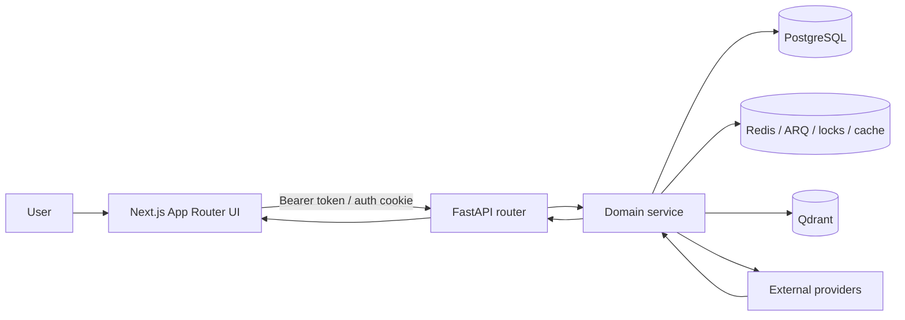

This is the common pattern across job, learning, roadmap, opportunity, and docs-RAG features.

## 2) Learning-resource flow

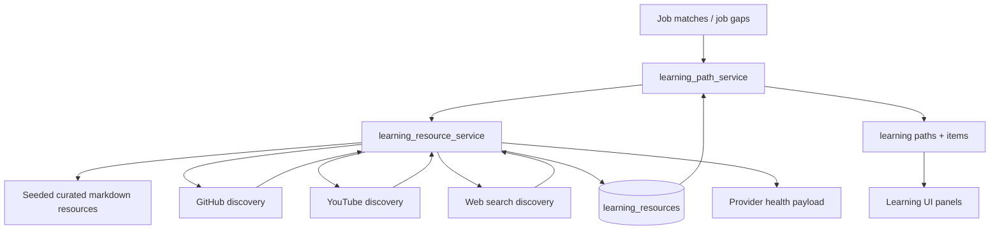

Real behaviors in code:

- seeded resources are always available as fallback
- live discovery is optional and provider-dependent
- resources are ranked by trust, relevance, freshness, and verification time
- learning paths are stored in Postgres

## 2.1) Learning outcome tracking flow

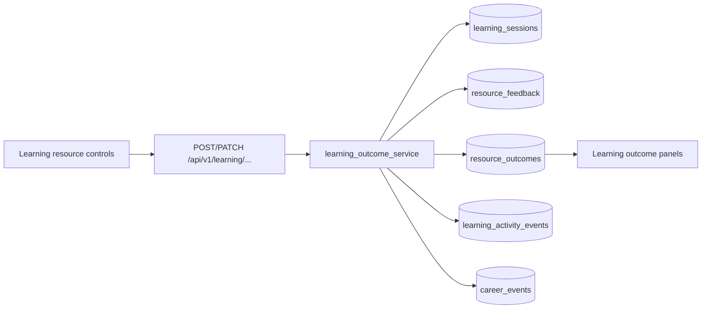

Real behaviors in code:

- open/start/progress/complete/abandon/feedback actions are persisted
- session and feedback records feed the aggregate outcome row
- outcome calculations stay honest by returning `insufficient_data` when starts and feedback are both absent
- CareerEvent writes are best-effort and never block the learning action

## 2.2) Skill graph import flow

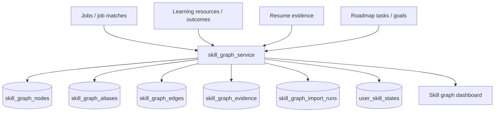

Real behaviors in code:

- skill graph nodes are evidence-backed rather than free-form
- aliases and edges are derived from the same normalized import pass
- import runs are persisted for auditability and dashboard inspection
- the frontend can trigger an authenticated import and then inspect the resulting graph

## 2.3) Evidence-backed skill gap flow

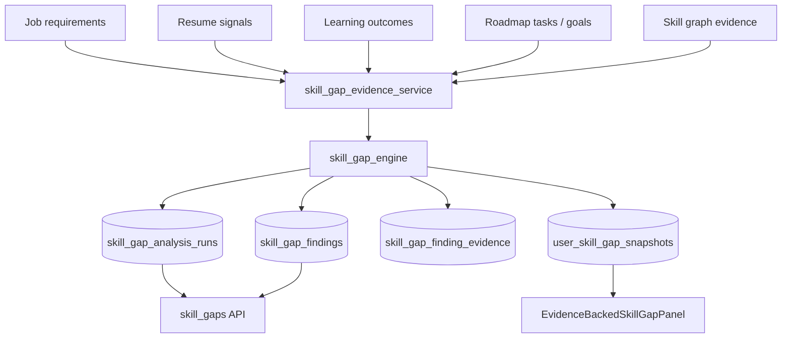

Real behaviors in code:

- analysis uses stored evidence rather than guessed scores
- missing inputs degrade to `insufficient_data` or legacy heuristics rather than fabricated certainty
- runs, findings, and snapshots are persisted for later comparison and review
- the frontend can ask the API for a job-scoped gap summary and render evidence chips

## 3) GitHub project discovery flow

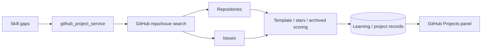

Current ranking signals are code-backed:

- stars
- template / starter / boilerplate wording
- archived penalty
- issue labels such as `good first issue` and `help wanted`

## 4) Docs-RAG flow

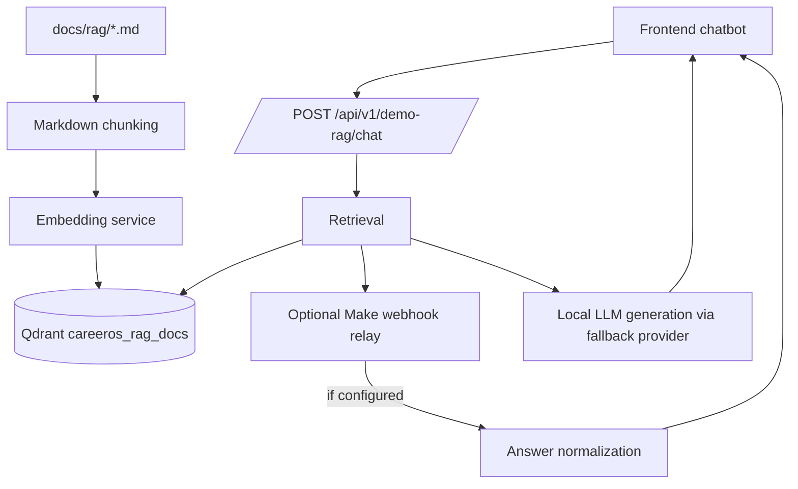

Real behavior:

- docs are discovered from `docs/rag/`
- chunk ids are stable and content-hash based
- embeddings are stored in `careeros_rag_docs`
- Make relay is optional; local generation is the fallback path

## 5) Job refresh and matching flow

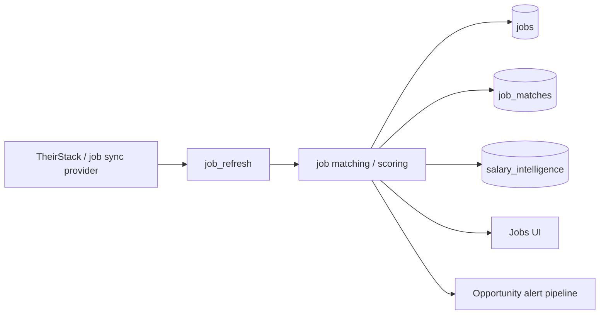

Current implementation includes:

- provider quota / failure handling
- stale / already-seen job detection
- refresh diagnostics
- job stats and provider health views

## 6) Opportunity / voice flow

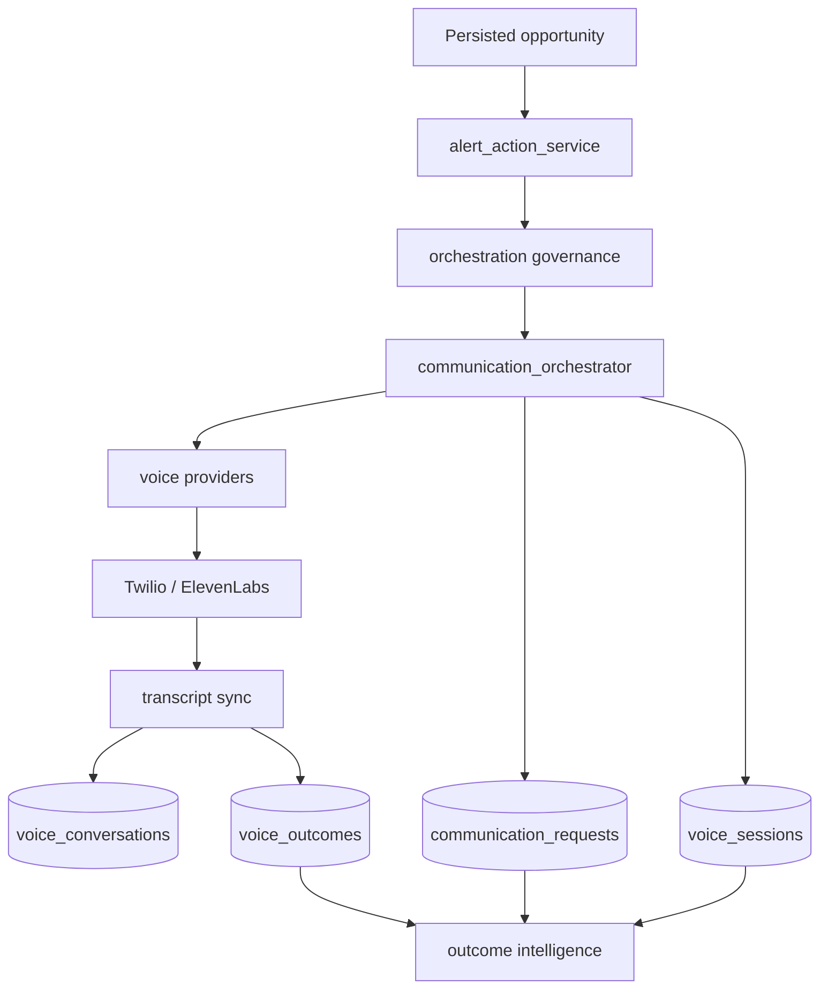

The current codebase stores communication state and later aggregates outcomes from those stored records.

## 7) Roadmap/progress flow

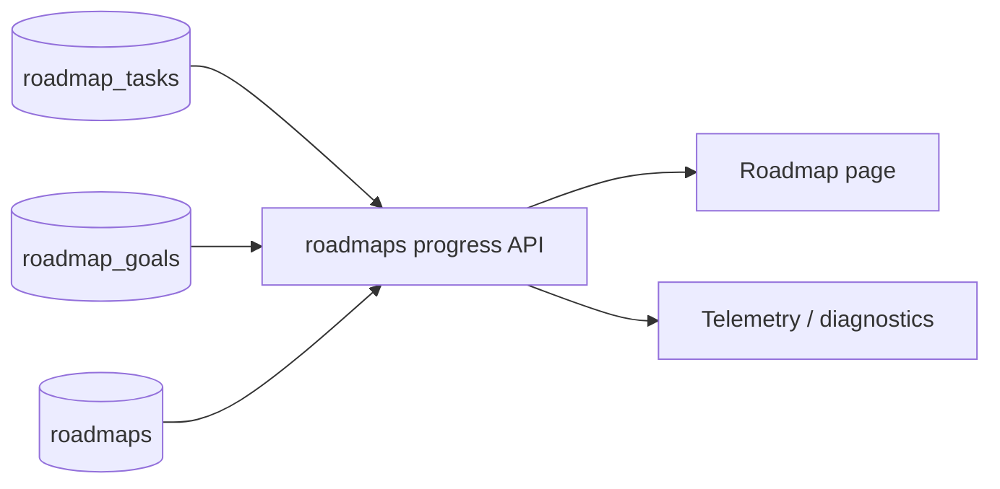

Important current behavior:

- progress is derived from stored task completion
- missing analytics fields are no longer treated as real telemetry
- diagnostics can say `not_tracked`

## 8) Event and worker flow

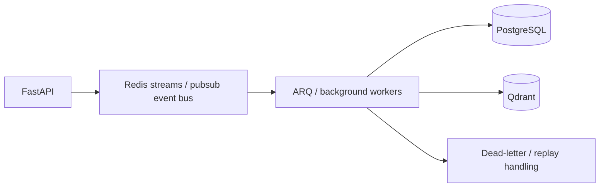

The event layer is important for future V2 work because it provides a foundation for auditability and replay.

## 10) Current data quality posture

The system already distinguishes between:

- real stored data
- seeded fallback data
- provider-unavailable states
- insufficient or missing evidence

That is a good base for V2, because it avoids the most dangerous anti-pattern: pretending a heuristic or empty field is a verified outcome.
