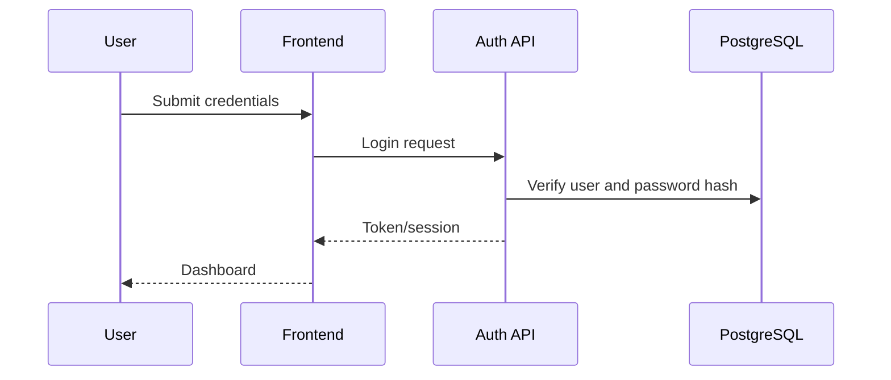

# 01 Auth Workflow

## Purpose

Authenticate users, protect API routes, and attach user identity to CareerOS workflows.

## User Flow

User opens login or registration, submits credentials, receives an access token, and then enters the authenticated workspace.

## API Flow

`/api/v1/auth/*` validates credentials, issues JWT/cookie state, and downstream endpoints use `get_current_user_id`.

## Database Flow

User records, password hashes, roles, and audit metadata are stored in PostgreSQL.

## Qdrant Flow

No direct Qdrant writes. Auth user id scopes later vector queries.

## LangGraph Flow

No direct graph execution. Auth identity gates graph-triggering endpoints.

## LLM Usage

None.

## Inputs

Email, password, registration profile, JWT/cookie.

## Outputs

Authenticated session, user id, role, authorization errors.

## Failure Scenarios

Invalid credentials, expired token, missing token, disabled user, development cookie settings used in production.

## Screenshots

Capture `/login`, successful dashboard load, and an unauthorized redirect.

## Sequence Diagram

