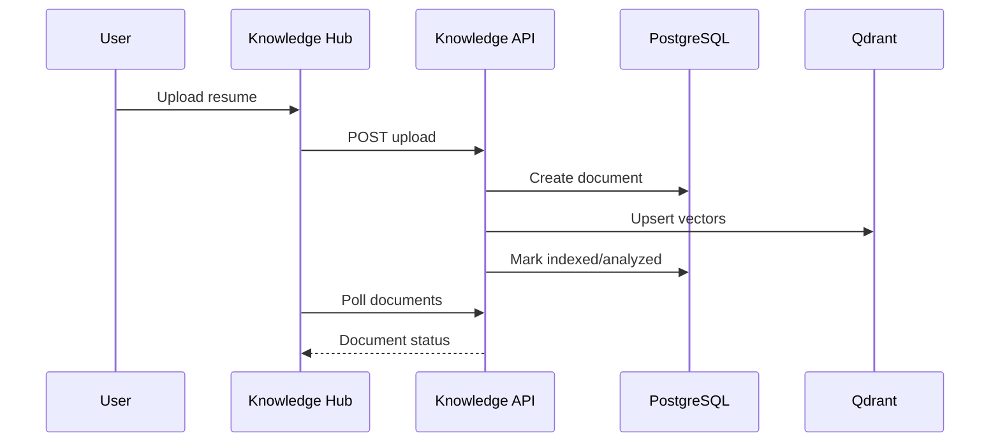

# 02 Knowledge Workflow

## Purpose

Upload, parse, store, and index resumes or knowledge documents for downstream CareerOS workflows.

## User Flow

User uploads a resume, waits for parsing/indexing, then selects the indexed document in analysis workflows.

## API Flow

`POST /api/v1/knowledge/upload` creates a document and starts background analysis. `GET /api/v1/knowledge` lists user documents.

## Database Flow

`knowledge_docs` stores document content, status, chunk count, and `analysis_results`.

## Qdrant Flow

Resume chunks are embedded and upserted into `careeros_resumes` with user and document metadata.

## LangGraph Flow

Knowledge upload is a linear pipeline: parse, mask, chunk, embed, index, evaluate.

## LLM Usage

Optional resume reasoning can use LLM services, but local deterministic analysis exists.

## Inputs

Filename, text content, optional base64 PDF content, user id.

## Outputs

Document id, processing status, indexed chunks, analysis run.

## Failure Scenarios

PDF extraction failure, empty content, embedding failure, Qdrant unavailable, database update failure.

## Screenshots

Capture Knowledge Hub upload, document status progression, and indexed document state.

## Sequence Diagram

