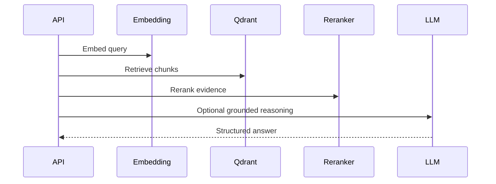

# 03 RAG Pipeline Workflow

## Purpose

Retrieve relevant profile context from indexed documents and use it to ground scoring, packages, recommendations, and orchestration.

## User Flow

User selects a resume or target workflow. CareerOS retrieves relevant chunks and displays a grounded result.

## API Flow

Workflow endpoints call retrieval services, rerank candidate context, and return structured outputs.

## Database Flow

Runs and outputs are stored in PostgreSQL where applicable.

## Qdrant Flow

Qdrant stores embedded resume chunks and supports similarity search with metadata filters.

## LangGraph Flow

Graph nodes typically follow: ingest, retrieve, rerank, reason, validate, persist.

## LLM Usage

LLM usage is optional per workflow and should be grounded by retrieved context.

## Inputs

User id, query, target JD, resume vector collection, filters.

## Outputs

Ranked chunks, citations, context bundle, structured workflow result.

## Failure Scenarios

No vectors, embedding provider failure, Qdrant timeout, low retrieval confidence, LLM timeout.

## Screenshots

Capture trace panel, rerank dashboard, and any citation/evidence section.

## Sequence Diagram

