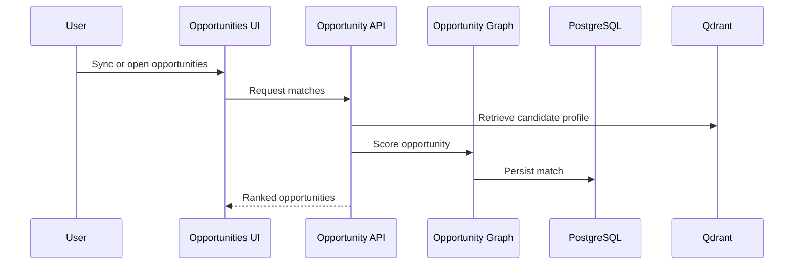

# 04 Opportunity Workflow

## Purpose

Discover, normalize, score, and persist job opportunities against a candidate profile.

## User Flow

User opens Opportunities or Jobs, syncs opportunities, reviews match cards, and selects high-fit targets.

## API Flow

Opportunity endpoints ingest jobs, compute match dimensions, list persisted matches, and trigger alerts.

## Database Flow

Jobs and job matches are stored in PostgreSQL with match score, strengths, gaps, source id, and metadata.

## Qdrant Flow

Candidate resume vectors provide context for matching.

## LangGraph Flow

Opportunity graph can discover, score, rank, and trigger alert nodes.

## LLM Usage

LLM can assist with semantic opportunity scoring and recommendation phrasing.

## Inputs

Candidate profile, job text, source URL, source provider, preferences.

## Outputs

Ranked opportunities, match scores, strengths, gaps, alert eligibility.

## Failure Scenarios

No indexed resume, job source unavailable, duplicate job ids, low confidence, alert provider failure.

## Screenshots

Capture Opportunity Center list, selected opportunity detail, and alert trigger result.

## Sequence Diagram

