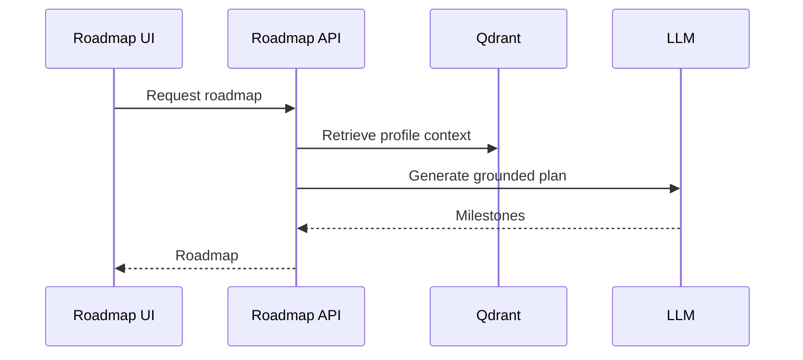

# 05 Roadmap Workflow

## Purpose

Turn candidate gaps and target roles into a practical learning and execution roadmap.

## Canonical Status Doc

- Current implementation and roadmap status are tracked in [docs/ROADMAP.md](../docs/ROADMAP.md)
- This workflow file is intentionally descriptive; it does not override the canonical roadmap status document.

## User Flow

User opens Roadmap, reviews gaps, follows milestones, and tracks readiness over time.

## API Flow

Roadmap endpoints gather profile, target preferences, readiness, and recommendations.

## Database Flow

Roadmap plans, tasks, status, and user preferences can be persisted in PostgreSQL.

## Qdrant Flow

Resume and knowledge chunks provide evidence for current skills and gaps.
Verified learning paths are seeded from real free resource URLs and surfaced when the user has authenticated skill gaps.

## LangGraph Flow

Roadmap graph can assess current state, identify gaps, rank actions, and produce milestones.

## LLM Usage

LLM may generate narrative guidance from grounded gaps and preferences.

## Inputs

Profile evidence, target role, timeline, preferences, match gaps.

## Outputs

Milestones, skill tasks, artifacts to build, readiness indicators.

## Failure Scenarios

Missing target role, no resume evidence, stale preferences, LLM unavailable.

## Screenshots

Capture Roadmap overview, milestone detail, and readiness/gap cards.

## Sequence Diagram

