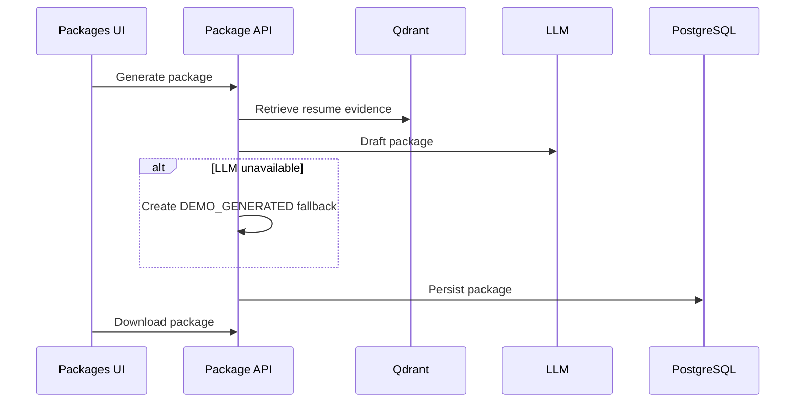

# 06 Package Workflow

## Purpose

Generate application packages for a target opportunity: resume, cover letter, messages, and interview prep.

## User Flow

User selects a job, generates a package, downloads outputs, and regenerates when needed.

## API Flow

Package endpoints create package jobs, poll status, return generated assets, and provide downloads.

## Database Flow

Application package records, versions, generated documents, and status are stored in PostgreSQL.

## Qdrant Flow

Retrieved resume evidence grounds tailored content.

## LangGraph Flow

Package workflow follows retrieve, draft, validate, persist, and download nodes.

## LLM Usage

LLM provider drafts tailored content. If it fails or times out, deterministic demo fallback generates a package marked `DEMO_GENERATED`.

## Inputs

Job id, candidate resume, retrieved context, package type.

## Outputs

Generated resume, cover letter, outreach messages, interview guide, downloadable files.

## Failure Scenarios

LLM timeout, missing job, no resume, storage failure. Demo fallback prevents package failure in mentor demo.

## Screenshots

Capture package list, generation status, `DEMO_GENERATED` marker, download, and regenerate.

## Sequence Diagram

