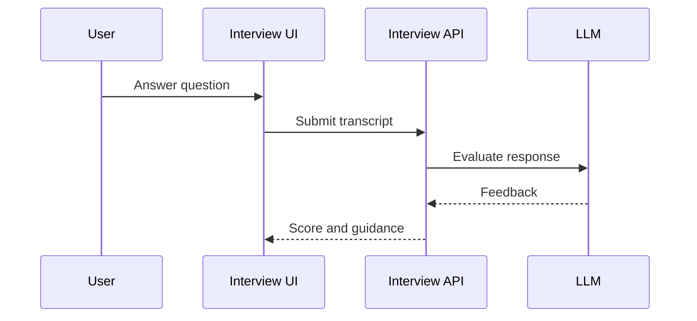

# 07 Interview Workflow

## Purpose

Help candidates practice interviews with transcript, scoring, confidence, and feedback.

## User Flow

User opens Interview, grants audio if needed, answers prompts, and reviews feedback.

## API Flow

Interview endpoints process session state, transcript, scoring, and feedback.

## Database Flow

Interview sessions, turns, confidence scores, and evaluations may be stored in PostgreSQL.

## Qdrant Flow

Resume and target role context ground interview questions and feedback.

## LangGraph Flow

Interview graph can generate question, listen/transcribe, evaluate, and recommend next prompt.

## LLM Usage

LLM can generate questions and feedback grounded in role/profile evidence.

## Inputs

Target role, resume context, audio/transcript, user answer.

## Outputs

Questions, transcript, live evaluation, feedback, readiness signals.

## Failure Scenarios

Microphone denied, transcription failure, LLM timeout, low evidence confidence.

## Screenshots

Capture audio gate, live transcript, control bar, and feedback state.

## Sequence Diagram

