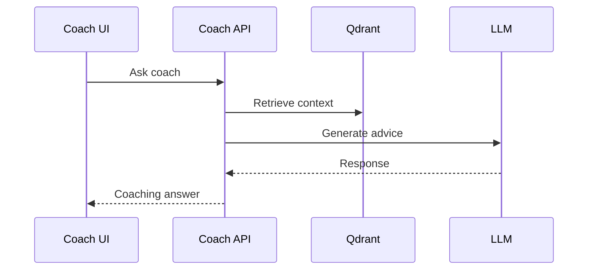

# 08 Coach Workflow

## Purpose

Provide career guidance, next actions, and profile-aware coaching.

## User Flow

User opens Coach, asks a question, receives grounded guidance and next steps.

## API Flow

Coach requests retrieve candidate context and generate recommendations.

## Database Flow

Coach sessions or preferences can be persisted for continuity.

## Qdrant Flow

Profile chunks, resume evidence, and knowledge documents ground the answer.

## LangGraph Flow

Coach graph can classify intent, retrieve context, reason, validate, and respond.

## LLM Usage

LLM produces advice from retrieved evidence and user intent.

## Inputs

User question, profile context, preferences, target role.

## Outputs

Coaching response, actions, suggested artifacts, confidence.

## Failure Scenarios

No context, ambiguous question, LLM unavailable, unsafe/unverifiable advice.

## Screenshots

Capture Coach prompt, grounded answer, and action recommendations.

## Sequence Diagram

