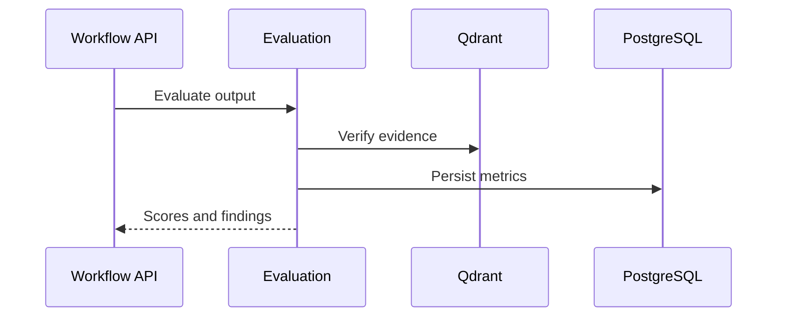

# 09 Evaluation Workflow

## Purpose

Evaluate outputs for ATS quality, schema validity, grounding, confidence, and readiness.

## User Flow

User opens Evaluation or a workflow result and reviews scoring, evidence, and risk indicators.

## API Flow

Evaluation services score outputs and return structured metrics.

## Database Flow

Evaluation results and run metadata may be persisted with workflow records.

## Qdrant Flow

Retrieved citations are checked against claims where evidence grounding is required.

## LangGraph Flow

Evaluation nodes validate generated output, citations, schema, and confidence.

## LLM Usage

LLM may judge semantic fit, but deterministic validators check structure and evidence.

## Inputs

Resume, JD, generated package, transcript, citations, rubric.

## Outputs

Scores, findings, recommendations, validation failures.

## Failure Scenarios

Schema mismatch, unsupported claim, missing citations, LLM disagreement, low confidence.

## Screenshots

Capture Evaluation dashboard, rerank/citation views, and validation warnings.

## Sequence Diagram

