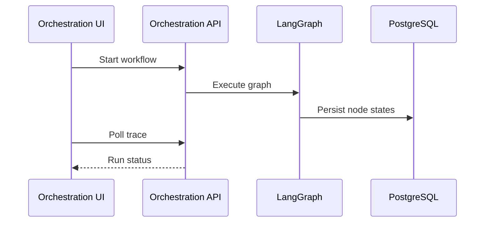

# 10 Orchestration Workflow

## Purpose

Coordinate multi-step CareerOS workflows and expose traceable execution state.

## User Flow

User opens Orchestration, starts or inspects workflows, and reviews status, traces, and outcomes.

## API Flow

Orchestration endpoints start runs, poll state, and return trace/history data.

## Database Flow

Workflow runs, nodes, statuses, errors, and artifacts are persisted.

## Qdrant Flow

Graph nodes may retrieve resume or opportunity context.

## LangGraph Flow

LangGraph coordinates nodes such as retrieve, score, generate, alert, approve, and persist.

## LLM Usage

LLM is invoked by graph nodes that need generation or semantic reasoning.

## Inputs

Workflow type, user id, resume/job ids, preferences, approval policy.

## Outputs

Run status, node trace, artifacts, errors, governance decisions.

## Failure Scenarios

Node timeout, provider failure, missing approval, invalid input, partial persistence.

## Screenshots

Capture Orchestration overview, live run, trace history, and node detail.

## Sequence Diagram

