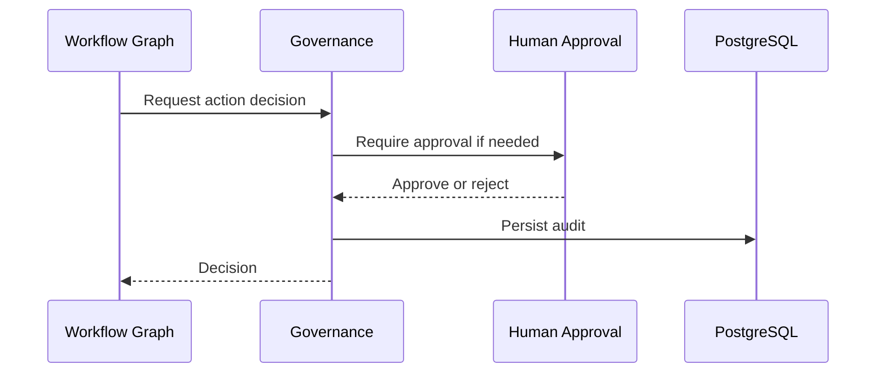

# 11 Governance Workflow

## Purpose

Apply safety, approval, audit, and policy checks to autonomous or externally visible actions.

## User Flow

User reviews governance state, approval requirements, and action logs.

## API Flow

Governance services evaluate action risk, record decisions, and enforce approval gates.

## Database Flow

Audit logs, approval records, and governance decisions are persisted.

## Qdrant Flow

Context can support evidence checks, but governance is primarily policy and audit state.

## LangGraph Flow

Governance nodes can pause workflows, request human approval, or block unsafe actions.

## LLM Usage

LLM may summarize risk, but deterministic policy controls final action permissions.

## Inputs

Action type, payload, risk level, user role, workflow context.

## Outputs

Approved, blocked, pending approval, audit record.

## Failure Scenarios

Missing approver, policy violation, ambiguous action, audit persistence failure.

## Screenshots

Capture governance dashboard, approval center, and action audit detail.

## Sequence Diagram

