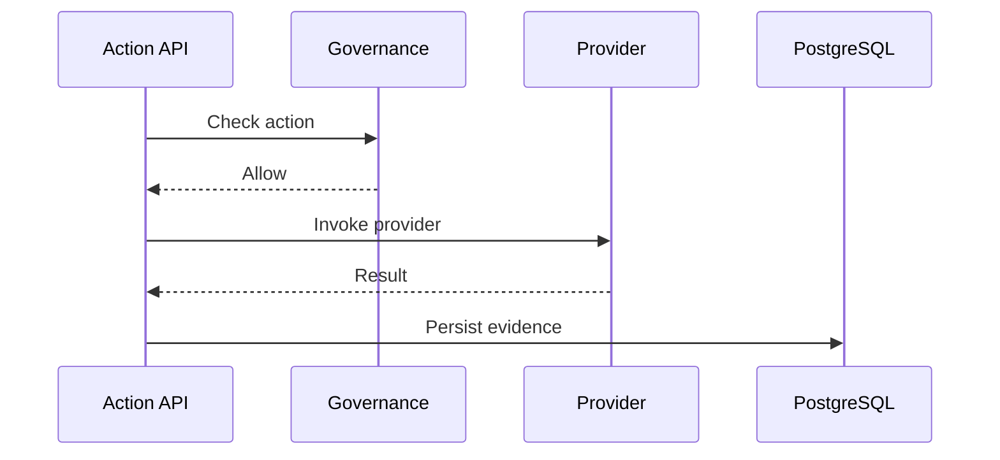

# 12 Autonomous Actions Workflow

## Purpose

Execute controlled outbound actions such as alerts, messages, or package generation with governance.

## User Flow

User configures preferences, triggers or approves an action, and reviews delivery evidence.

## API Flow

Action endpoints validate inputs, pass governance, call provider integrations, and persist evidence.

## Database Flow

Actions, statuses, provider responses, and audit events are stored.

## Qdrant Flow

Action payloads may use retrieved resume/job evidence.

## LangGraph Flow

Autonomous action graph evaluates opportunity, checks policy, generates payload, invokes provider, records outcome.

## LLM Usage

LLM may draft messages or summaries before deterministic provider calls.

## Inputs

Action request, candidate context, opportunity context, preferences, approval state.

## Outputs

Delivery status, provider response, audit log, user notification.

## Failure Scenarios

Provider auth failure, approval missing, rate limit, invalid destination, payload generation failure.

## Screenshots

Capture action queue, approval state, provider result, and audit entry.

## Sequence Diagram

