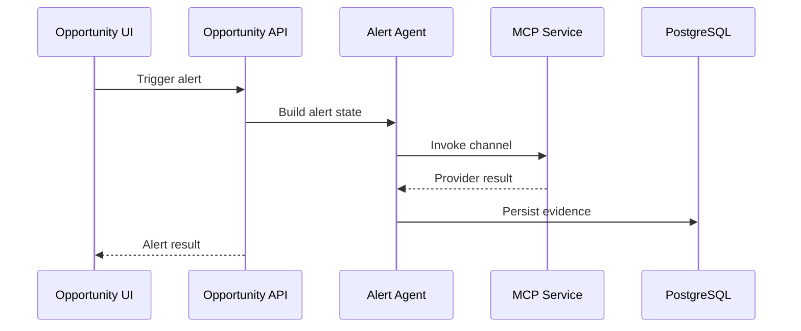

# 13 Opportunity Alert Agent Workflow

## Purpose

Evaluate high-priority opportunities and trigger alert workflows for candidates.

## User Flow

User reviews a matched opportunity and triggers an alert or watches an automated alert result.

## API Flow

`/api/v1/opportunities/alert` loads a persisted match, scores urgency, runs alert agent, and records outcome.

## Database Flow

Opportunity match and alert delivery evidence are persisted.

## Qdrant Flow

Candidate context can enrich the alert message and confidence.

## LangGraph Flow

Alert graph evaluates match, urgency, channel eligibility, message generation, and provider invocation.

## LLM Usage

LLM may generate alert message text or voice script.

## Inputs

Match id, candidate profile, job record, alert preferences.

## Outputs

Alert status, urgency score, notification message, provider evidence.

## Failure Scenarios

Match not found, alert disabled, low score, provider auth failure, governance block.

## Screenshots

Capture opportunity detail, alert trigger, command-center action evidence.

## Sequence Diagram

