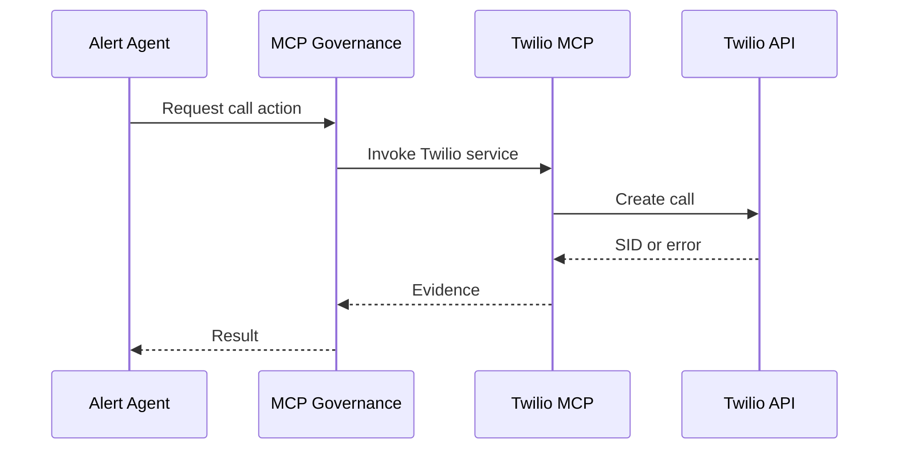

# 14 Twilio MCP Workflow

## Purpose

Place or simulate telephony alerts through the Twilio MCP integration with auditable provider evidence.

## User Flow

User triggers an opportunity alert. If Twilio is enabled and approved, CareerOS invokes the MCP service.

## API Flow

Opportunity alert endpoint calls MCP governance, which invokes the Twilio MCP service with candidate/job context.

## Database Flow

Alert state, provider result, and governance evidence are persisted.

## Qdrant Flow

No required direct vector operation, though alert context can come from prior opportunity matching.

## LangGraph Flow

Alert graph calls Twilio node after scoring and governance checks.

## LLM Usage

Optional voice script generation can use LLM or ElevenLabs-related services before Twilio call placement.

## Inputs

Candidate name, job title, company, match score, urgency, destination number.

## Outputs

Call workflow evidence, provider status, call SID when successful.

## Failure Scenarios

Twilio HTTP 401, invalid phone number, missing env vars, network timeout, governance block.

## Screenshots

Capture Command Center Twilio action, provider error/success evidence, and certification document.

## Sequence Diagram

