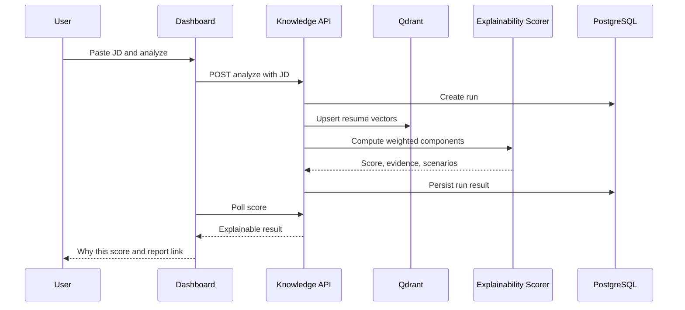

# 15 Alignment Matcher Workflow

## Purpose

Explain how a candidate resume aligns with a pasted JD using indexed resume evidence, deterministic scoring, and a human-readable score trace.

## User Flow

User uploads or selects an indexed resume, pastes the JD, clicks Analyze Alignment Match, reviews the score, expands Why this score, and opens the full report.

## API Flow

`POST /api/v1/knowledge/{doc_id}/analyze` accepts `job_description`, creates a run, and starts background analysis. `GET /api/v1/knowledge/{doc_id}/score` polls results. `GET /api/v1/knowledge/alignment-report/{run_id}` loads the report page.

## Database Flow

The analysis run is persisted inside `knowledge_docs.analysis_results` with status, JD, score, components, evidence, and scenarios.

## Qdrant Flow

Resume chunks are embedded and upserted into `careeros_resumes`. The current explainability layer is deterministic, while the pipeline preserves vector indexing for RAG transparency and future retrieval-backed citations.

## LangGraph Flow

The visible trace follows ingest, redaction, embedding, retrieval, reranking, scoring, and persistence stages.

## LLM Usage

The explainability score does not require an LLM. Optional resume reasoning can use LLM services, but the score formula is deterministic and reproducible.

## Inputs

Resume document id, resume content, pasted JD, current user id.

## Outputs

Overall score, grade, component breakdown, weights, contributions, matched evidence, missing evidence, suggestions, report URL.

## Failure Scenarios

No indexed resume, empty JD, missing document, background analysis failure, Qdrant indexing failure, stale report id.

## Screenshots

Capture dashboard score, Why this score table, trace panel, strengths/gaps, and `/workflow/alignment-report/[runId]`.

## Sequence Diagram

