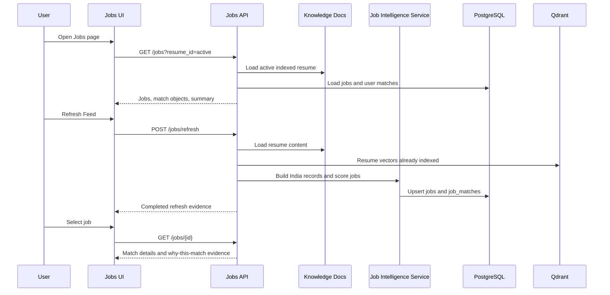

# 16 Job Intelligence Workflow

## Purpose

Transform the Jobs page into a resume-centric opportunity intelligence platform for Indian candidates, with explainable scoring and transparent provider constraints.

## Provider Flow

CareerOS maintains a provider catalog for:

- Naukri
- Indeed India
- LinkedIn Jobs
- Internshala
- Foundit
- Wellfound
- Cutshort

Because general job-search APIs are unavailable, gated, or terms-restricted, V2 uses supported search-link records and normalized India-focused job records instead of unauthorized scraping.

## Matching Flow

```text
Active Resume
-> Skill extraction
-> Education extraction
-> Experience extraction
-> Location extraction
-> Preference enrichment
-> India provider discovery
-> Job normalization
-> Per-job score
-> Persist job match details
```

## Scoring Flow

Each job receives these dimensions:

- Education Match
- Skill Match
- Project Match
- Experience Match
- Certification Match
- Location Match
- Keyword Match
- Semantic Similarity
- Overall Match

Formula:

```text
overall_match =
  education_match * 0.15 +
  skill_match * 0.25 +
  project_match * 0.15 +
  experience_match * 0.15 +
  certification_match * 0.10 +
  location_match * 0.08 +
  keyword_match * 0.07 +
  semantic_similarity * 0.05
```

## Resume Flow

The active resume is selected from indexed/analyzed Knowledge Hub documents. The UI displays:

- Resume name
- Index status
- Upload date
- Chunk count
- Embedding status
- Vector count

If no resume exists, the Jobs page says `No indexed resume selected.`

## Database Flow

Tables:

- `knowledge_docs`: active resume, text, chunk count, status.
- `jobs`: normalized provider/search-link job records.
- `job_matches`: per-user, per-resume match scores and explainability.

Persisted match fields:

- Overall score
- Skill, experience, and education score columns
- Gap score
- Strengths
- Gaps
- Recommendation
- `match_details` JSON with all dimensions, weights, evidence, missing skills, and active resume metadata
- Resume document uid/name

## Qdrant Flow

Resume upload still indexes chunks into `careeros_resumes`. Jobs V2 uses deterministic scoring for transparency, while preserving the vector count and Qdrant-backed resume status in the active-resume indicator.

## Frontend Flow

The Jobs page:

1. Loads active resume metadata.
2. Calls `/jobs?resume_id=<activeDocId>`.
3. Calls `/jobs/stats?resume_id=<activeDocId>`.
4. Displays evaluated job count, average/high/low match, active resume, top matches, provider filters, and job details.
5. On Refresh Feed, calls `/jobs/refresh` with the active resume id.
6. On job select, calls `/jobs/{id}?resume_id=<activeDocId>`.
7. Shows `Why this match?` with component evidence.

## API Flow

- `GET /api/v1/jobs`
- `GET /api/v1/jobs/stats`
- `GET /api/v1/jobs/{job_id}`
- `POST /api/v1/jobs/refresh`

`POST /jobs/refresh` now returns completed resume-centric evaluation rather than only enqueueing a generic scraper.

## Inputs

- Active resume id
- Resume text and metadata
- Target role preference
- Target location preference
- Salary preference
- Provider catalog
- Existing and normalized job records

## Outputs

- India-focused job feed
- Top matches
- Average/high/low alignment
- Per-job match object
- Per-job scoring dimensions
- Matched skills
- Missing skills
- Apply/search URL
- Provider constraints

## Failure Scenarios

| Scenario | Behavior |
| --- | --- |
| No indexed resume | UI displays `No indexed resume selected`; refresh returns blocked status. |
| No provider API access | Uses provider search links and documented constraints; no unauthorized scraping. |
| No jobs in database | V2 seeds normalized India-focused records for supported demo/development flow. |
| Match details missing | Job appears as uncalculated rather than showing a fake `0%`. |
| Qdrant unavailable | Resume metadata still displays database chunk count; scoring uses stored resume text. |
| Provider terms change | Provider catalog should be reviewed before enabling any automated integration. |

## Screenshots

Capture:

- Jobs page active resume indicator.
- Refresh Feed pipeline.
- Average/high/low alignment panel.
- Top Matches.
- Selected job detail.
- Why this match table.
- Provider filters.

## Sequence Diagram



